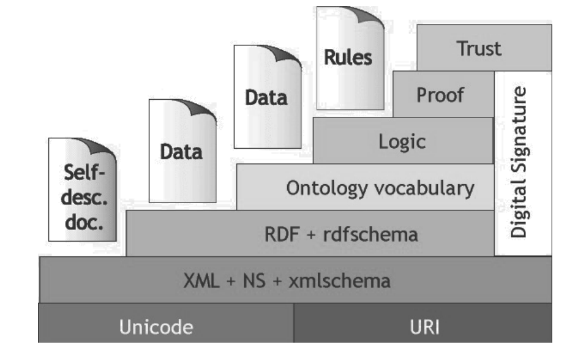

# **Chapter 1**
# **The Semantic Web Vision**

**Table of Content**
- [1.1 Giới thiệu](#11-giới-thiệu)
	- 1.1.1 Động lực của Semantic Web
	- 1.1.2 Quyết định thiết kế cho Semantic Web
	- 1.1.3 Cộng nghệ cơ bản cho Semantic Web
	- 1.1.4 Từ dữ liệu tới tri thức
	- 1.1.5 Kiến trúc web của Semantic Web
- [1.2 Công nghệ Semantic Web](#12-công-nghệ-Semantic-Web)
	- 1.2.1 Siêu dữ liệu rõ ràng
	- 1.2.2 Bản thể luận
	- 1.2.3 Logic
- [1.3 Phương pháp tiếp cận theo lớp](#13-phương-pháp-tiếp-cận-theo-lớp)
- [1.4 Tổng kết](#14-tổng-kết)
---

## **1.1 Introduction**
### **1.1.1 Motivation for the Semantic Web**
- Tầm nhìn khái quát của "Mạng ngữ nghĩa" là: *Làm cho máy tính dễ dàng truy cập web hơn*.  
- Máy tính đóng vai trò rất *hạn chế* trong trang web hiện nay: lập chỉ mục từ khóa, và đưa thông tin từ server đến clients, và chỉ có vậy.  
- Những công việc thông minh (chọn lọc, kết hợp, tổng hợp, ...) đều được xử lý bởi người đọc.  
- Điều gì xảy ra nếu chúng ta làm web gần gũi hơn với máy móc, để nó chưa đầy dữ liệu máy có thể đọc được, *"hiểu được"*? 
Một trang web như vậy sẽ tạo ra nhiều điều kiện thuật lợi mà trang web hiện nay không có: Tìm kiếm không còn chỉ đơn giản là việc tìm từ 
khóa, nó có thể trở nên nhiều ngữ nghĩa hơn, gồm tìm kiếm từ đồng nghĩa, nhận thức được từ đồng âm và tính đến ngữ cảnh và mục đích 
của truy vấn. Trang web có thể trở nên cá nhân hóa hơn nếu các *agent trình duyệt cá nhân* (personal browsing agent) có thể hiểu được nội 
dung của một trang web và điều chỉnh cho nó phù hợp với hồ sơ quan tâm cá nhân (personal interest profile). Liên kết (Linking) có thể trở 
nên ngữ nghĩa hơn bằng việc quyết định một cách linh động xem trang nào sẽ là đích đến, dựa trên hoạt động của người dùng hiện tại, thay 
vì cố định các liên kết giống nhau cho tất cả các người dùng. Nó cũng khả thi trong việc *tính hợp* thông tin giữa các trang web, thay vì 
người dùng phải tạo ra một "mental copy-paste" (sao chép tinh thần) mỗi khi tìm kiếm thông tin ở một trang và muốn kết hợp với thông tin 
ở trang khác.  

### **1.1.2 Design Decisions for the Semantic Web**
- **Mạng ngữ nghĩa** tuân theo các nguyên tắc thiết kế khác nhau, có thể tóm gọn lại như sau:  
	1. Cung cấp dữ liệu có cấu trúc và bán câu trúc ở các định dạng chuẩn hóa trên web;  
	2. Không chỉ với các bộ dữ liệu, mà cả các phần tử dữ liệu riêng lẻ ([data-element](https://en.wikipedia.org/wiki/Data_element)) 
và các mối quan hệ của chúng cũng có thể truy cập được trên web;  
	3. Mô tả ngữ nghĩa dự định của dữ liệu (intended semantics) theo một hình thức quy định cụ thể, để máy có thể xử lý ngữ nghĩa 
dự định này.  
- Chúng ta sẽ đạt được bước tiến lớn đối với tầm nhìn của **Mạng ngữ nghĩa** khi mà chúng ta có thể xuất bản và liên kết với các bộ dữ 
liệu có cấu trúc cơ sở.  

### **1.1.3 Basic Technology for the Semantic Web**
- Những nguyên tắc ở trên đã được chuyển về những công nghệ thực tế như sau:
	1. Sử dụng *Đồ thị có nhãn** (labeled graphs) làm mô hình dữ liệu (data model) cho đối tượng và mối quan hệ của chúng, với đối 
tượng là các node và các đường đi là mối quan hệ của chúng. RDF (Resource Description Framework) là phương thức chính được sử dụng để 
mô tả các đồ thị này.  
	2. Sử dụng *Định danh Web* (web identifiers - Uniform Resource Identifiers - URI) để định danh các mục dữ liệu riêng biệt ([data-items](https://www.pcmag.com/encyclopedia/term/data-item)) 
và mối quan hệ của chúng ở trong bộ dữ liệu (datasets). Và điều này cũng được biểu diễn bằng RDF.  
	3. Sử dụng những *Ontology* (Hệ thống từ vựng phân cấp về kiểu và quan hệ) làm mô hình dữ liệu chính thức thể hiện ngữ nghĩa dự định 
của dữ liệu. Các hình thức như RDF Schema và Ngôn ngữ bản thể học Web (The Web Ontology Language - OWL) được sử dụng cho mục đích 
này, một lần nữa sử dụng URI để đại diện cho các kiểu và thuộc tính của chúng.  

### **1.1.4 From Data to Knowledge**
- Để có thể nắm bắt toàn bộ ngữ nghĩa của dữ liệu, các hình thức như là RDF Schema và OWL không chỉ là ngôn ngữ biểu diễn dữ liệu, mà con là *ngôn 
ngữ biển diễn tri thức nhẹ* (lightweight knowledge representation languages). Chúng là "những logic" cho phép suy luận thêm thông tin từ các thông 
tin đã được đưa ra.  
	- Lược đồ Schema biểu diễn logic rất nghèo nàn chỉ cho phép một số suy luận đơn giản, chẳng hạn như thừa kế thuộc tính qua hệ thống phân cấp các kiểu 
và suy luận về kiểu của các giới hạn về và phạm vị.  
	- OWL phong phú hơn về logic (nhưng vẫn rất nhẹ) cho phép các suy luận bổ sung như bình đẳng và bất bình đẳng, giới hạn số lượng, sự tồn tại của các 
đối tượng và những thứ khác.  
	- Những suy luận như vậy trong RDF Schema và OWL cung cấp cho các nhà phát hành (Publisher) thông tin khả năng tạo ra một giới hạn (lower-bound) tổi 
thiểu của các dữ kiện mà người đọc phải tin vào dữ liệu đã phát hành. Ngoài ra, OWL còn cung cấp cho các nhà pháp hành thông tin khả năng ngăn cả người đọc 
tin một số điều nhất định về dữ liệu đã phát hành.  
- Cùng với nhau, việc thực hiện các suy luận như vậy đối với các logic này đặt ra cả giới hạn dươi (lower-bound) và giới hạn trên (upper bound) trên ngữ nghĩa 
dự định của dữ liệu được phát hành. Bằng cách tinh chỉnh các Ontology, các giới hạn này có thể di chuyển tạm thời gần nhau, do đó xác định được chính xác hết 
ngữ nghĩa dự định của dữ liệu, trong phạm vi yêu cần của cá trường hợp sử dụng.  

### **1.1.5 The Web Architecture of the Semantic Web** 
- Trên web truyền thống, nôi dung của nó được phân phố cả về vị trí lẫn người sở hữu: các trang web liên kết với nhau thường nằm ở những máy chủ khác nhau và các 
máy chủ này vị trí địa lý cũng khác nhau và được sở hữu bởi những nhóm khác nhau.  
- *Bất kỳ ai cũng có thể tham khảo trang web của bất kỳ ai mà không cần phải thương lượng trước về quyền hoặc yêu cầu về địa chỉ hoặc định danh phù hợp để sử dung. 
Một cơ chế tương tự hoạt động trong Semantic Web: Bên thứ nhất có thể phát hành tập dữ liệu trên web, bên thứ hai phát hành độc lập từ vựng của các term và bên 
thứ ba có thể quyết định chú thích đối tượng của bên thứ nhất bằng một thuật ngữ do bên thứ hai xuất bản mà không cần xin phép một trong hai bên và trên thực tế, 
một trong hai bên kia cũng không cần biết về điều đó. Chính sự phân tách này là bản chất của đặc tính giống như web của **Mạng ngữ nghĩa**.  

### **1.1.6 How to Get There from Here**
- Tất nhiên, cần có một số bước quan trọng để biến tầm nhìn và các quy tắc kiến trúc trên thành sự thật:  
	1. Chúng ta cần đồng thuận về cú pháp tiêu chuẩn để đại diện cho dữ liệu và siêu dữ liệu (metadata).  
	2. Chúng ta cần phải có đủ thỏa thuận về từ vựng siêu dữ liệu để chia sẻ ngữ nghĩa dự định của dữ liệu.  
	3. Chúng ta cần phát hành khối lượng lớn dữ liệu ở các định dạng của bước 1 và sử dụng từ vựng của bước 2.  
- Trong thập kỷ qua, tiến bộ đáng kể đã đạt được trên cả ba bước này: ngôn ngữ RDF, RDF Schema và OWL (và các biến thể của chúng) đều nhận được sự hỗ trợ chính thức 
của (W3C)[https://vi.wikipedia.org/wiki/W3C], nâng chúng lên thành các tiêu chuẩn thực tế trên web.  
- Hàng nghìn từ vựng được phát hành bằng các định dạng này và sự hội tụ của các từ vựng này bắt đầu xảy ra, vừa là kết quả của công nghệ lập ánh xạ bản thể học tự động (automated ontology mapping technology) 
vừa dưới áp lực của các nhu cầu xã hội và kinh tế. Và sự tăng trưởng của Linked Data Cloud đã dẫn đến hàng tỷ đối tượng và các mối quan hệ của chúng trở nên khả dụng một cách trực tuyến, bằng việc sử dụng các từ vựng và cú pháp được chia sẻ.  

## **1.2 Semantic Web Technologies**
### **1.2.1 Explicit Metadata**
- Hiện tại, nội dung web được định dạng để phù hợp với người đọc, thay vì với những chương trình. Với con người, thông tin được trình một cách phù hợp, nhưng với máy thì tồn tại nhiều vướng mắc.    
```html
<h1>Trung tâm vật lý trị liệu Agilitas</h1>
Chào mừng đến với trung tâm vật lý trị liệu Agilitas
Bạn cảm thấy đau mỏi? Bạn bị chấn thương? Hãy để nhân viên của chúng tôi
Lisa Davenport, Kelly Townsend (Thư ký)
và Steve Matthews giúp đỡ bạn
<h2>Giờ tư vấn</h2>
Mon 11am - 7pm<br>
Tue 11am - 7pm<br>
Wed 3pm - 7pm<br>
Thu 11am - 7pm<br>
Fri 11am - 3pm<p>
Lưu lý rằng chúng tôi không chúng cấp các giờ tư vấn
trong các tuần của trò chơi
<a href=¨. . .¨>State of Origin</a>.
```
- Các tìm kiếm dựa trên từ khóa sẽ xác định những từ *vật lý trị liệu* và *giờ tư vấn*. Và một agent thông minh thậm trí xác định đươc cả nhân viên của trung tâm. 
Nhưng chúng sẽ gặp vấn đề khó khăn trong việc phân biệt các *nhà trị liệu* với *thư ký*, hay khó khăn trong việc tìm *giờ tư vấn* chính xác.  
- Cách tiếp cận của **Mạng ngữ nghĩa** để giải quyết vấn đề này không phải là sự phát triển của các tác nhân siêu thông minh, mà nó đề xuất tiếp cận vấn đề từ phía 
trang web. Nếu HTML được thay thế bằng các ngôn ngữ thích hợp hơn, thì các trang web có thể mang nội dung của chúng ở lớp bên ngoài. Ngoài việc chứa các thông tin 
về định dạng nhằm tạo ra tài liệu cho người đọc, chúng có thể chứa thông tin về nội dung của chúng.  
- Ở bước đầu tiên theo hướng đi này là **eXtensible Markup Language (XML)**, thứ cho phép ta xác định cấu trúc của thông tin trên các trang web. Ở ví dụ trên chúng 
ta sẽ có những thông tin như sau:  
```xml
<company>
	<treatmentOffered>Physiotherapy</treatmentOffered>
	<companyName>Agilitas Physiotherapy Centre</companyName>
	<staff>
		<therapist>Lisa Davenport</therapist>
		<therapist>Steve Matthews</therapist>
		<secretary>Kelly Townsend</secretary>
	</staff>
</company>
```  
- Cách biểu diễn này sẽ khiến cho máy dễ dàng xử lý hơn. Đặc biệt, nó hữu ích cho việc trao đổi thông tin trên web, một trong những ứng dụng nổi bật của XML.  
- Tuy nhiên, XML vẫn còn ở cấp độ cú pháp, vì nó mô tả cấu trúc của thông tin, nhưng không mô tả được *ý nghĩa* của nó. Ngôn ngữ cơ bản của **Web ngữ nghĩa** 
là RDF, là ngôn ngữ để đưa ra các phát biểu (statement) về các mẩu của thông tin. Trong ví dụ của chúng ta, gồm những phát biểu sau:  
	Company A offer physiotherapy.  
	The name of A is "Agitilitas Physiotherapy".  
	Lisa Davenport is a therapist.  
	Lisa Davenport works for A.  
	...  
- Với người đọc, sự khác biệt giữa cách biểu diễn XML và danh sách những phát biểu RDF có thể rất nhỏ, nhưng chúng hoàn toàn khác nhau về bản chất: XML mô tả 
cấu trúc còn RDF tạo ra những phát biểu về những mẩu thông tin.  
- Thuật ngữ *metadata* đề cập đến những thông tin như vậy: dữ liệu về dữ liệu. *Metadata* nắm bắt phần *ý nghĩa* của dữ liệu, và đó là thuật ngữ *ngữ nghĩa* 
trong **Web ngữ nghĩa**.  

### **1.2.2 Ontologies**
- Thuật ngữ *bản thể luận (ontology)* là tên của một lĩnh vực triết học, nghiên cứu về bản chất của sự tồn tại, nhánh của siêu hình học liên quan đến việc xác 
định những thứ thực sự tồn tại và cách mô tả chúng. Ví dụ, nhận xét rằng thế giới được tạo thành từ các đối tượng cụ thể có thể nhóm lại thành các lớp trừu 
tượng dựa trên các thuộc tính được chia sẻ.  
- *Bản thể luận* là một đặc tả rõ ràng và chính thức của một khái niệm hóa.  
- Nói chung, *bản thể luận* mô tả chính thức một miền (domain) của vấn đề đang nói đến. Thông thường, *bản thể luận* bao gồm một danh sách hữu hạn các thuật 
ngữ (term) và mối quan hệ giữa các thuật ngữ này. Các thuật ngữ biểu thị các khái niệm quan trọng (các lớp đối tượng) của miền.  
- Các *mối quan hệ (relationship)* thường bao gồm phân cấp của các lớp. Một hệ thống phân cấp chỉ định lớp C1 là một lớp con của một lớp C2 khác, thì mọi đối 
tượng trong C1 cũng nằm trong C2.  
- Ngoài các mối quan hệ lớp con, *bản thể luận* còn có thể bao gồm các thông tin như:  
	- Tính chất (ví dụ: X dạy Y);  
	- Các ràng buộc giá trị (ví dụ: chỉ giảng viên mới có thể dạy các khóa học);  
	- Các phát biểu rời rạc (disjointness statments) (ví dụ: giảng viên và nhân viên là rời rạc);  
	- Đặc tả mối quan hệ logic giữa các đối tượng (ví dụ: mọi khoa phải bao gồm ít nhất 10 giảng viên).  
- Trong ngữ cảnh web, *bản thể luận* cung cấp sự hiểu biết chung về một miền. Sự chia sẻ như vậy là cần thiết để vượt qua sự khác biệt về thuật ngữ. Mã zip của 
một ứng dụng (application) có thể giống với mã bưu điện của ứng dụng khác. Hay hai ứng dụng có thể sử dụng cùng một thuật ngữ nhưng khác nhau về ý nghĩa.  
- Những khác biệt như vậy có thể được khắc phục bằng cách ánh xạ thuật ngữ cụ thể tới *bản thể luận* dùng chung hoặc xác định ánh xạ trực tiếp giữa các *bản thể luận*.  
- *Bản thể luận* hữu dụng trong việc tổ chức và điều hướng của trang web.  
- *Bản thể luận* cũng hữu dụng trong việc cải thiện độ chính xác của web tìm kiếm. Các công cụ tìm kiếm có thể tìm kiếm các trang đề cập đến một khái niệm chính 
xác trong *bản thể luận* thay vì thu thập tất cả các trang trong đó với những từ khóa nhất định, mơ hồ. Bằng cách này, sự khác biệt thuật ngữ giữa các trang web và truy 
vấn được khắc phục.  
- Web tìm kiếm có thể khai thác các thông tin tổng quát hoặc chuyên môn. Nếu một truy vấn thất bại trong việc tìm tài liệu thích hợp, công cụ tìm kiếm có thể gợi ý người 
dùng một truy vấn tổng quát hơn. Thậm chí nó có thể chủ động chạy các truy vấn tổng quát để giảm thời gian tiếp nhận trong trường hợp người dùng chấp nhận một đề xuất. 
Hoặc nếu quá nhiều câu trả lời được truy xuất, công cụ có thể gợi ý người dùng một số chuyên môn.  
- Các ngôn ngữ quan trọng của *bản thể luận* là:  
	- RDF Schema là một ngôn ngữ mô tả từ vựng dùng để mô tả các thuộc tính và lớp của tài nguyên RDF, với ngữ nghĩa để phân cấp tổng quát các thuộc tính và lớp đó. 
Ngoài ra, miền và phạm vi thuộc tính có thể được xác định.  
	- OWL là một ngôn ngữ mô tả từ vựng phong phú hơn để mô tả các thuộc tính và lớp, chẳng hạn như quan hệ giữa các lớp (ví dụ: tính rời rạc), số lượng (ví dụ: chính xác một), 
đồng cấp, cách nhập phong phú hơn của các thuộc tính, đặc điểm của các thuộc tính (ví dụ: đối xứng), và các lớp được liệt kê.  

### **1.2.3 Logic**
- Đầu tiên, logic cung cấp ngôn ngữ chính thức để diễn đạt tri thức.  
- Thứ hai, logic cung cấp cho chúng ta dạng dễ hiểu của ngữ nghĩa: ý nghĩa của câu được xác định mà không cần sử dụng tri thức. Thường chúng ta nói về [kiến thức khai báo](https://trainingindustry.com/glossary/declarative-knowledge/#:~:text=Declarative%20knowledge%20refers%20to%20facts,their%20relation%20to%20each%20other.)(declarative knowledge) như sau: 
Chúng ta mô tả những gì nắm giữ mà không quan tâm đến việc nó có thể được suy luận ra sao.  
- Thứ ba, bộ suy luận tự động (automated resoners) có thể suy luận những kết luận từ tri thức được cho, làm cho kiến thức tiềm ẩn trở nên rõ ràng.  
- Logic có thể sử dụng để khai phá tri thức bản thể luận (ontological knowledge). Bằng cách này, logic có thể giúp ta phát hiện ra các mối quan hệ bất ngờ và mâu thuẫn.  
- Nhưng logic khái quát hơn các *bản thể luận*, nó cũng có thể đực sử dụng bởi các agent thông minh trong việc đưa ra quyết định và lựa chọn các hướng hành động.  
- Có sự đánh đổi giữa sức mạnh biểu đạt và hiệu quả tính toán. Logic diễn đạt càng rõ ràng thì việc đưa ra các kết luận càng trở nên tốn kém về mặt tính toán. Và việc đưa ra các kết luận 
nhất định có thể trở nên bất khả thi nếu gặp phải các rào cản không tính toán được. May mắn thay, các tri thức liên quan đến **Mạng ngữ nghĩa** đều ở dạng tương đối đơn giản.  
- Một ưu điểm quan trọng của logic là cung cấp những lời giải thích (explanations) cho các kết luận (conclusion): chuỗi các bước suy luận có thể truy vết. Hơn nữa, các nhà nghiên cứu AI đã 
phát triển các cách trình bày những lời giải thích theo cách thân thiện với con người, bằng cách cấu tạo một lập luận (proof) như một phép suy diễn tự nhiên và nhóm một số bước suy luận cấp 
thấp thành metasteps và con người gọi nó là bước lập luận đơn (single proof step).  
- Một lời giải thích có thể truy vết câu hỏi ngược về tập sự thật (set of facts) và các quy tắc suy luận đã được sử dụng.  
- Lời giải thích mang tầm quan trọng trong **Mạng ngữ nghĩa** vì chúng tăng độ tin cậy của người dùng vào các agent **Mạng ngữ nghĩa**.  
- Lời giải thích cũng cần thiết cho các hoạt động giữa các agent. Khi một vài agent xây dựng kết luận logic, những agent khác sẽ xác thực những bằng chứng, để xác định xem điều agent khác đưa ra có đúng hay không.  
- Để logic trở nên hữu ích hơn trên web, nó phải có thể sử dụng được có thể dùng được cùng với các dữ liệu khác và phải có thể xử lý bằng máy. Do đó, việc biểu diễn kiến thức logic và chứng mình bằng ngôn ngữ web luôn hiện hữu. Các phương pháp tiếp cận ban đầu hoạt động ở cấp độ XML, nhưng trong tương lai, các quy tắc và chứng minh sẽ cần được biểu diễn ở cấp độ ngôn ngữ RDF và bản thể luận.  

### **1.2.4 Mạng ngữ nghĩa với Trí tuệ nhân tạo**
- Như chúng ta đã nói, phần lớn những công nghệ để hiện thức hóa **Mạng ngữ nghĩa** đều được xây dựng dựa trên các hoạt động trong lĩnh vực của trí tuệ nhân tạo.  
- Hiện thực hóa **Mạng ngữ nghĩa** không phụ thuộc vào trí thông minh ở mức độ con người.  
- Trên **Mạng ngữ nghĩa**, các giải pháp từng phần hoạt động. Kể cả việc agent thông minh không thể đưa ra tất cả các kết luận mà người dùng có thể, agent đó vẫn có thể làm cho một trang web vượt trội nhưng trang web hiện tại.  
- Nếu mục tiêu của AI là xây dựng một agent thông minh đạt đến tầm hiểu biết của con người (hoặc hơn), thì của **Mạng ngữ nghĩa** chỉ là hỗ trợ những hoạt động online thường ngày của người dùng.  
- **Mạng ngữ nghĩa** sử dụng những công nghệ của AI và những tiến bộ trong những công nghệ đó sẽ dẫn tới một **Mạng ngữ nghĩa** tốt hơn. Nhưng không cần chờ đến khi AI có những tiến bộ vượt bậc, những công nghệ AI hiện tại đã đủ để thực hiện việc hiện thực hóa tầm nhìn của **Mạng ngữ nghĩa**.  

## **1.3 A layered Approach**
- Phát triển **Mạng ngữ nghĩa** tiến hành qua nhiều bước, mỗi bước sẽ xây dựng một lớp (layer) lên trên một cái khác.  
- Bản chất của **Mạng ngữ nghĩa** là các công ty và người dùng phải xây dựng những công cụ, thêm nội dung và sử dụng nội dung đó.  
- Trong việc xây dựng một lớp của **Mạng ngữ nghĩa** trên một lớp khác, hai quy tắc cần phải bám theo là:  
	- Khả năng tương thích từ trên xuống. Agent nắm chắc một lớp cũng có thể giải thích và sử dụng thông tin được viết ở các lớp thấp hơn.  
	- Hiểu rõ từng phần từ dưới lên. Phải thiết kế sao cho các agent nắm chắc về một lớp sẽ có thể tận dụng ít nhất một phần của thông tin ở cấp cao hơn.  
- Dù những ý tưởng này hấp dẫn về mặt lý thuyết và được sử dụng làm nguyên tắc dẫn lối cho sự phát triển của **Mạng ngữ nghĩa** nhưng việc thực hiện chúng trên thực tế lại trở nên khó khăn và cần phải thực hiện một số thỏa hiệp.  
  
- "Layer Cake" mô tả những lớp chính khi thiết kế và hình dung **Mạng ngữ nghĩa**.
- Ở dưới cùng chung ta có XML, ngôn ngữ cho phép ta viết về cấu trúc của tài liệu web với những từ vựng người dùng tự định nghĩa. XML đặc biệt thích hợp để gửi tài liệu trên web. Ngoài ra, các URI được sử dụng trong XML có thể được nhóm theo namespace của chúng, được ký hiệu bởi NS trong sơ đồ.  
- RDF là một mô hình cơ bản, nhưng là mô hình thực thể-quan hệ (Entity-relationship model), để viết những phát biểu đơn giản về các đối tượng web (tài nguyên). Mô hình dữ liệu RDF không dựa vào XML nhưng RDF lại có cú pháp dựa trên XML. Và đó là tại sao RDF được đặt phái trên lớp XML.  
- RDF Schema cung cấp các nguyên tắc mô hình hóa để tổ chức các đối tượng web thành các cấu trúc phân cấp. Các thành phần chính ban đầu là các lớp và thuộc tính, lớp con và các mối quan hệ của lớp con, và giới hạn về miền và phạm vi. RDF Schema dựa trên RDF. RDF Schema có thể được xem như một ngôn ngữ nguyên thủy để viết các bản thể luận. Nhưng cần có các ngôn ngữ bản thể luận mạnh mẽ hơn để mở rộng RDF Schema và cho phép biểu diễn các mối quan hệ phức tạp hơn giữa các đối tượng web. 
Lớp logic được sử dụng để nâng cao ngôn ngữ bản thể luận và cho phép diễn tả [declarative knowledge](https://trainingindustry.com/glossary/declarative-knowledge/#:~:text=Declarative%20knowledge%20refers%20to%20facts,their%20relation%20to%20each%20other.) cho ứng dụng.  
- Lớp lập luận (proof layer) liên quan đến quá trình suy diễn thực tế cũng như việc trình bày các minh chứng bằng ngôn ngữ web (từ các cấp thấp hơn) và xác nhận minh chứng.  
- Cuối cùng lớp tin cậy (trust layer) sẽ xuất hiện thông quan việc sử dụng chữ ký số và các loại kiến thức khác, dựa trên các khuyến nghị của các agent đáng tin cậy hoặc các cơ quan xếp hạng và chứng nhận và người sử dụng. Đôi khi cụm từ "Web of trust" được sử dụng để chỉ ra rằng sự tin tưởng sẽ được tổ chức theo các phân tán và hỗn loạn như chính những trang web. Nằm ở đỉnh của cái bánh, niềm tin là một khái niệm cấp cao và quan trọng: web sẽ chỉ đạt được hoàn toàn tiềm năng khi người dùng tin tưởng vào hoạt động của nó (bảo mật) và vào chất lượng thông tin được cung cấp.  
- "Layer cake" hiện tại giờ đã khá lỗi thời. Đặc biệt, một số lựa chọn thay thế cho lớp từ vựng bản thể luận (ontology vocabulary) đã xuất hiện. Ngoài ra, các ngôn ngữ quy tắc đã được xác định trên RDF bỏ qua lớp từ vựng bản thể luận; điều này đặc biệt đúng trong sự thay đổi gần cây từ cấu trúc ngữ nghĩa phong phú sang xử lý một lượng lớn dữ liệu (ngữ nghĩa). Do đó "Layer cake" được đưa vào đây để minh họa cách nhìn về **Mạng ngữ nghĩa**.  

## **1.4 Summary**
- **Mạng ngữ nghĩa** nhằm cải thiện tình trạng hiện tại của World Wide Web;  
- Ý tưởng chính là sử dụng thông tin web có thể xử lý bằng máy;  
- Công nghệ chính bao gồn xuất bảng dữ liệu thành siêu dữ liệu rõ ràng, bản thể luận, logic và suy luận;  
- Phát triển **Mạng ngữ nghĩa** được tiến hành theo từng lớp.  
