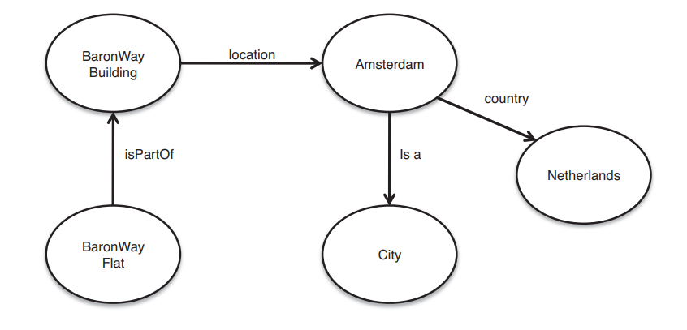
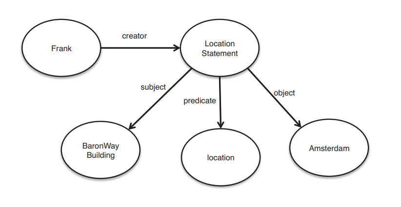
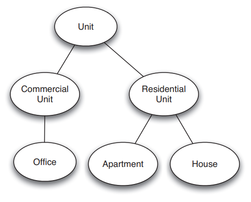
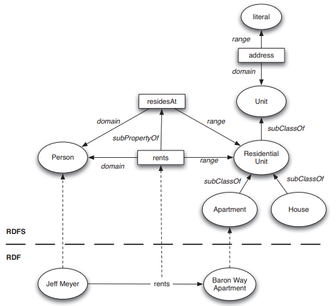
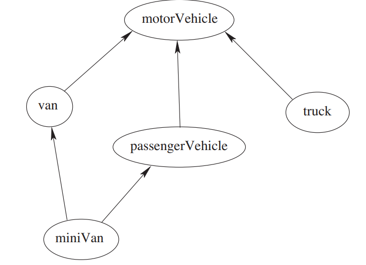

# **Chapter 2**
# **Describing Web Resources**
# **RDF**

# **Table of contents**
- [**2.1 Giới thiệu**](#21-giới-thiệu)  
- [**2.2 RDF: Mô hình dữ liệu**](#22-rdf-mô-hình-dữ-liệu)  
	- **2.2.1 Tài nguyên**  
	- **2.2.2 Thuộc tính**  
	- **2.2.3 Phát biểu**  
	- **2.2.4 Đồ thị**  
	- **2.2.5 Trỏ tới những Phát biểu và Đồ Thị**  
	- **2.2.6 Đối phó với những dự đoán phong phú hơn**  
- [**2.3 Cú pháp RDF**](#23-cú-pháp-rdf)  
	- **2.3.1 Turtle**
	- **2.3.2 Các cú pháp khác**  
- [**2.4 RDFS: Thêm ngữ nghĩa**](#24-rdfs-thêm-ngữ-nghĩa)  
	- **2.4.1 Lớp và thuộc tính**  
	- **2.4.2 Hệ thống phân cấp và kế thừa**  
	- **2.4.3 Phân cấp thuộc tính**  
	- **2.4.4 RDF so với các lớp RDFS**  
- [**2.5 RDF Schema: Ngôn ngữ**](#25-rdf-schema-ngôn-ngữ)
	- **2.5.1 Các lớp cốt lõi**  
	- **2.5.2 Các thuộc tính cốt lõi dùng để xác định quan hệ**  
	- **2.5.3 Thuộc tính cốt lõi để hạn chế thuộc tính**  
	- **2.5.4 Các thuộc tính hữu ích trong việc cải tiến**  
	- **2.5.5 Các lớp Container**  
	- **2.5.6 Các thuộc tính tiện ích**  
	- **2.5.7 Ví dụ: Nhà ở**  
	- **2.5.8 Ví dụ: Phương tiện**  
- [**2.6 RDF và RDF Schema trong lược đồ RDF**](#26-rdf-và-rdf-schema-trong-lược-đồ-rdf)  
	- **2.6.1 RDF**  
	- **2.6.2 RDF Schema**  
- [**2.7 Ngữ nghĩa tiên đề cho RDF và RDF Schema**](#27-ngữ-nghĩa-tiên-đề-cho-rdf-và-rdf-schema)  
	- **2.7.1 Tiếp cận**  
	- **2.7.2 Những vị từ cơ bản**  
	- 

---
## **2.1 Giới thiệu**
- HTML là một ngôn ngữ tiêu chuẩn dùng để xây dựng nên các trang web. Nó cho phép chúng ta xuất bản tài liệu và đảm bảo rằng tài liệu sẽ được hiển thị chính xác trên bất kỳ trình duyệt web nào.  
- Gồm có ba phần hợp thành HTML (và bất kỳ ngôn ngữ chuyển đổi) là: 
	- Cú pháp (syntax): Chỉ cho chúng ta cách để biểu diễn dữ liệu;  
	- Mô hình dữ liệu (data model): Chỉ cho chúng ta về cấu trúc hoặc cách tổ chức của dữ liệu;  
  	- Ngữ nghĩa (semantic): Chỉ cho chúng ta cách thông dịch dữ liệu đó.  

```html
<html>
	<head>
		<title>Apartments for Rent</title>
	</head>
	<body>
		<ol>
			<li> Studio apartment on Florida Ave.
			<li> 3 bedroom Apartment on Baron Way
		</ol>
	</body>
</html>
```  

- Cú pháp của HTML là văn bản gồm các thẻ được biểu diễn bằng các dấu ngoặc nhọn.  
- Mô hình dữ liệu của HTML hay Mô hình Đối tượng Tài Liệu (Document Object Model), xác định cách tổ chức của các thành phần được định nghĩa bằng các thẻ thành một cấu trúc cây phân cấp.  
- Ngữ nghĩa của HTML cho ta biết về cách trình duyệt thông dịch trang web. Ví dụ, trình duyệt hiển thị nội dung phần thân của trang web trong cửa sổ trình duyệt và phần tử `<ol>` sẽ được hiển thị dưới dạng danh sách có thứ tự.  
- Cú pháp, mô hình dữ liệu và ngữ nghĩa đều được xác định trong tiêu chuẩn HTML.  
- HTML được thiết kế để truyền đạt thông tin về cấu trúc của tài liệu đến người dùng. Nhưng **Mạng ngữ nghĩa** cần một cái gì đó tốt hơn. Ta cần một mô hình dữ liệu có thể sử dụng bởi nhiều ứng dụng hơn, không chỉ để mô tả tài liệu cho con người mà còn diễn tả thông tin dành riêng cho ứng dụng.  
- Mô hình dữ liệu này cần trở nên không phụ thuộc vào miền để các ứng dụng từ bất động sản đến mạng xã hội đều có thể tận dụng nó. Ngoài ra, một mô hình dữ liệu linh hoạt, chúng ta cần một cơ chế để gán ngữ nghĩa cho thông tin được biểu diễn bằng cách sử dụng mô hình dữ liệu này. Nó sẽ cho phép người dùng mô tả cách ứng dụng giải nghĩa từ "bạn bè" trong mạng xã hội và "thành phố" trong một mô tả địa lý.  
- Cuối cùng chúng ta cần một cách để có thể thể hiện tất của những thông tin này - một cú pháp.  
- RDF (Resource Description Framework) cung cấp đúng mô hình linh hoạt như vậy. Nền móng của nó là thực thể-thuộc tính-giá trị, gọi là phát biểu (statement). 
Ví dụ như:
	- “The Baron Way Apartment is an Apartment” 
	- “The Baron Way Apartment is part of The Baron Way Building” 
	- “The Baron Way Building is located in Amsterdam”
- Vì RDF không dành riêng cho bất kỳ miền hay mục đích sử dụng nào, nó cần thiết để người dùng tự định nghĩa thuật ngữ họ sử dụng trong các phát biểu này.  
- Để làm được điều này, họ sử dụng RDF Schema (RDFS), nó cho phép người dùng định nghĩa chính xác cách từ vựng (hay là thuật ngữ) của họ được diễn giải như thế nào.  
- Kết hợp lại, các công nghệ này xác định thành phần của một ngôn ngữ chuẩn để trao đổi dữ liệu tùy ý giữa các máy:
	- RDF - Mô hình dữ liệu;  
	- RDFS - Ngữ nghĩa;  
	- Turtle/ RDFa/ RDF-XML - Cú pháp.  

## **2.2 RDF: Mô hình dữ liệu**
### **2.2.1 Tài nguyên**
- Chúng ta có thể nghĩ rằng tài nguyên chính là đối tượng, thứ mà chúng ta muốn nhắc tới. Tài nguyên có thể là địa điểm, con người, truy xuất tìm kiếm, ... .  
- Mỗi một tài nguyên sẽ có một URI. Một URI có thể là URL (Uniform Resource Locator, hay địa chỉ web) hoặc một các gì đấy dùng để định danh. 
- URI cung cấp một cơ chế để xác định rõ ràng "thứ" mà chúng ta muốn nói đến. Vì vậy, khi ta nói swimming pool, chúng ta sẽ sử dụng URI gán cho swimming pool và nó sẽ không bị nhầm lẫn với billiards (pool) hay a group of people (the pool of programmers). Đây gọi là vấn đề đồng âm.   
- Việc sử dụng URI không nhất thiết cần cho phép truy chấp vào tài nguyên. Tuy nhiên, việc sử dụng các URL cho phép tham chiếu được các mã định danh tài nguyên được coi là một phương pháp hay. Nó cho phép người dùng truy xuất chính tài nguyên (trong trường hợp là hình ảnh) hoặc mô tả thêm về tài nguyên (trong trường hợp là người).  
- Việc sử dụng URI là một trong những quyết định thiết kế quan trọng đằng sau RDF. Nó cho phép kế hoạch đặt tên một cách toàn cầu, và mỗi tên là duy nhất trên toàn thế giới diễn ra.  
- Việc sử dụng một kế hoạch như vậy giảm thiểu đáng kể về vấn đề đồng âm - thứ cản trở việc biểu diễn dữ liệu phân tán cho đến nay.  

### **2.2.2 Thuộc tính**
- Thuộc tính là một loại đặc biệt của tài nguyên; chúng mô tả mối quan hệ giữa các tài nguyên khác - ví dụ như: "bạn của", "được viết bởi" và "đặt tại".  
- Như tất cả các tài nguyên, thuộc tính cũng được định danh bằng URI.  
- Chúng ta có thể tham chiếu các URL thuộc tính để tìm các mô tả của chúng.  

### **2.2.3 Phát biểu**
- Phát biểu xác nhận những thuộc tính của tài nguyên.  
- Một phát triểu là một bộ ba thực thể-thuộc tính-giá trị gồm một tài nguyên, một thuộc tính và một giá trị.  
- Giá trị có thể là một tài nguyên hoặc là một trực nghĩa (nghĩa đen - literals).  
- Trực nghĩa là atomic value - ví dụ như: số, chuỗi hoặc ngày tháng.  
- Chúng ta thường sử dụng từ chủ thể (subject) để chỉ thực thể (entity) trong một phát biểu và đối tượng (object) để chỉ giá trị của nó.  
Ví dụ: Có một phát biểu: "Baron Way Buildings is located in Amsterdam"  
Ta sẽ viết thành:  
```
<http://www.semanticwebprimer.org/ontology/apartments.ttl#BaronWayBuilding>
<http://dbpedia.org/ontology/location>
<http://dbpedia.org/resource/Amsterdam>
```  

### **2.2.4 Đồ thị**
- Chúng ta cũng có thể viết cùng một phát biểu dưới dạng đồ thị.  


- Những nốt được gán nhãn được kết nối bởi các đường được gán nhãn. Các đường có hướng từ chủ thể phát biểu đến đối tượng phát biểu, với nhãn trên đường là thuộc tính của phát biểu.  
- Nhãn trên các nốt là định danh của chủ thể và đối tượng.  
- Đối tượng của phát biểu này có thể là chủ thể của phát biểu khác ("Amsterdam is a city").  
- Biểu diễn đồ thị nhằm làm nổi bật rằng RDF là một mô hình dữ liệu có trọng tâm là đồ thị.  
- Biểu đồ này có thể tạo ra theo kiểu phân tán bởi nhiều người tham gia khác nhau chỉ bằng sử dụng các URL giống nhau. Điều này cho phép chúng ta tạo ra *Web of Data* cho phép tri thức được tái sử dụng - ví dụ: nếu ta tìm thấy RDF trên trang web mô tả về Amsterdam, ta có thể tái sử dụng thông tin đó bằng việc sử dụng URL đó. Thật vậy, có một tập hợp các phương pháp tối ưu nhất, gọi là *nguyên tắc Dữ Liệu liên kết (Linked Data principles)*, nó khuyến khích ta tái sử dụng và cung cấp thông tin khả dụng để hỗ trợ tạo ra đồ thị toàn cầu.  
	1. Sử dụng URI làm tên cho mọi thứ.  
	2. Sử dụng những HTTP URI để mọi người có thể tra cứu những cái tên đó.  
	3. Khi ai đó tra cứu một URL, cung cấp những thông tin hữu ích, sử dụng những tiêu chuẩn (RDF).  
	4. Bao gồm liên kết tới các URI khác để họ có thể khám phá nhiều thứ hơn.  
- Khi mô hình dữ liệu RDF không yêu cầu ta tuân theo những tiêu chuẩn này, nhưng nếu đi theo tiêu chuẩn, ta có thể tận dụng tri thức được đóng góp từ người khác.  

### **2.2.5 Trỏ tới những Phát biểu và Đồ thị** 
- Đôi khi rất hữu ích khi có thể trỏ tới những phát biểu cụ thể và những phần của đồ thị, chẳng hạn như khi ấn định mức độ tin tưởng vào một phát biểu hoặc xác định nguồn gốc của phát biểu. Ví dụ như: ta muốn nói rằng phát biểu về vị trí của Baron Way Building được tạo ra bởi một người tên Frank. RDF cung cấp hai cơ chế để làm điều này.  
- Cái thứ nhất được gọi là *reification(cải tổ)*. Ý tưởng chính đằng sau reification là đưa vào một đối tượng bổ trợ cẳng hạn như LocationStatement và liên hệ nó với từng phần trong ba phần của phát biểu ban đầu thông qua các thuộc tính chủ thể, vị từ và đối tượng.  
  
- Trong ví dụ trước, chủ thể của *LocationStatement* sẽ là *BaronWayBuilding*, vị từ sẽ là *location* và đối tượng sẽ là Amsterdam. Sau đó, ta có thể dẫn tới phát biểu trong chủ thể của bộ ba khác điều đó xác định người tạo ra (creator).  
- Việc tiếp cận này khá rườm rà này là cần thiết vì bộ ba chỉ nằm trong RDF; vậy nên ta không thể thêm một định danh trực tiếp vào một bộ ba. Do chi phí sửa đổi lớn, trong phiên bản mới hơn của RDF, khái niệm về các đồ thị được đặt tên đã được đưa ra. Ở đây, một định danh rõ ràng (một URL) được cấp cho một phát biểu hoặc một tập hợp những phát biểu. Mã định danh này sau đó có thể được tham chiếu trong bộ ba thông thường. Đây là một cơ chế đơn giản hơn để xác định các phát biểu cũng như đồ thị. Nói một cách đơn giản, một đồ thị được đặt tên cho phép ta khoanh tròn một tập hợp các phát biểu RDF và cung cấp cho các phát biểu này một mã định danh.  

### **2.2.6 Đối phó với những dự đoán phong phú hơn**
- Ta có thể nghĩ rằng bộ ba *(x, P, y)* là một biểu thức logic *P(x, y)*, khi đó vị từ nhị phân (binary predicate) P liên hệ đối tượng x tới đối tượng y. Thực tế, RDF chỉ cung cấp vị từ nhị phân (các thuộc tính). Tuy nhiên, vài trường hợp ta có thể cần vị từ có nhiều hơn 2 đối số. May thay, các vị từ như vậy có thể mô phỏng bởi một số vị từ nhị phân.  
Ví dụ như sau: broker(X, Y, Z) nghĩa là "X is broker in home sale between seller Y and purchaser Z".  
Bây giờ ta cần thêm một tài nguyên phụ trợ mới *home-sale* và một vị từ nhị phân *broker*, *seller* và *purchaser*. Sau đó ta biểu diễn broker(X, Y, Z) như sau:  
broker(home-sale, X)  
seller(home-sale, Y)  
purchaser(home-sale, Z)  

- Mặc dù vị từ ba đối số sẽ được viết ngắn gọn hơn, nhưng việc dùng các vị từ nhị phân sẽ đơn giản hóa mô hình dữ liệu tổng thể.  

## **2.3 Cú pháp RDF**
### **2.3.1 Turtle**
- Terse RDF Triple Language (Turtle) là một cú pháp dựa trên dạng văn bản cho RDF.  
- File Turtle có đuôi là `.ttl`.  
Ví dụ:  
```Turtle
<http://www.semanticwebprimer.org/ontology/apartments.ttl#BaronWayBuilding>
<http://dbpedia.org/ontology/location>
<http://dbpedia.org/resource/Amsterdam>.
```  
- Các URL được đặt trong dấu ngoặc nhọn. Chủ thể, thuộc tính và đối tượng của phát biểu xuất hiện theo thứ tự, theo sau là một dấu chấm.  
- Chúng ta có thể mô tả toàn bộ đồ thị RDF chỉ bằng cách này.  
```Turtle
<http://www.semanticwebprimer.org/ontology/apartments.ttl#>
	<http://www.semanticwebprimer.org/ontology/apartments.ttl#isPartOf>
	<http://www.semanticwebprimer.org/ontology/apartments.ttl#BaronWayBuilding>.
<http://www.semanticwebprimer.org/ontology/apartments.ttl#BaronWayBuilding>
	<http://dbpedia.org/ontology/location>
	<http://dbpedia.org/resource/Amsterdam>.
```  

#### **2.3.1.1 Trực nghĩa**
- Chúng ta đã định nghĩa rằng phát biểu là thứ liên kết những tài nguyên lại với nhau. Như đã nói ở trên phát biểu còn có thể bao gồm cả trực nghĩa, nó là một atomic value trong RDF.  
- Trong Turtle, ta biểu diễn trực nghĩa trong cặp nháy kép và kèm theo đó là kiểu dữ liệu.  
- Kiểu dữ liệu cho chúng ta biết liệu chúng ta có nên diễn giải một giá trị với string, một ngày, số nguyên hay một kiểu dữ liệu khác.  
- Các kiểu dữ liệu lại được biểu diễn dưới dạng URL. Nên sử dụng những kiểu dữ liệu được định nghĩa bằng Lược đồ XML, khi này các giá trị sẽ tuân theo định nghĩa Lược đồ XML.  
- Nếu không có kiểu dữ liệu được khai báo phía sau một trực nghĩa, nó sẽ được coi là một string.  
```Turtle
string - "Baron Way"
integers - "1"^^<http://www.w3.org/2001/XMLSchema#integer>
decimals - "1.23" <http://www.w3.org/2001/XMLSchema#decimal>
dates - "1982-08-30"^^<http://www.w3.org/2001/XMLSchema#date>
time - "11:24:00"^^<http://www.w3.org/2001/XMLSchema#time>
date with a time - "1982-08-30T11:24:00"^^<http://www.w3.org/2001/XMLSchema#dateTime>
```  
- Giả sử nếu ta muốn thêm vào đồ thị rằng Căn hộ Baron Way có ba phòng ngủ. Ta sẽ thêm một phát biểu trong Turtle vào đồ thị như sau:  
```Turtle
<http://www.semanticwebprimer.org/ontology/apartments.ttl#BaronWayApartment>
<http://www.semanticwebprimer.org/ontology/apartments.ttl#hasNumberOfBedrooms>
"3"^^<http://www.w3.org/2001/XMLSchema#integer>.

<http://www.semanticwebprimer.org/ontology/apartments.ttl#BaronWayApartment>
<http://www.semanticwebprimer.org/ontology/apartments.ttl#isPartOf>
<http://www.semanticwebprimer.org/ontology/apartments.ttl#BaronWayBuilding>.

<http://www.semanticwebprimer.org/ontology/apartments.ttl#BaronWayBuilding>
<http://dbpedia.org/ontology/location>
<http://dbpedia.org/resource/Amsterdam>.
```  

#### **2.3.1.2 Viết tắt**
- Thông thường khi chúng ta định nghĩa một từ vựng, chúng ta cũng làm vậy với URI. Trong ví dụ phía trên, tài nguyên Baron Way Apartment và Baron Way Building đều cùng được định nghĩa tại URL http://www.semanticwebprimer.org/ontology/apartments.ttl. URL này định nghĩa tên không gian (namespace) của những tài nguyên. Turtle tận dụng những quy ước này để chop phép các URL được viết tắt. Nó cung cấp cú pháp @prefix để định nghĩa một cách viết tắt cho một tên không gian cụ thể.  
**Ví dụ:** Ta có thể nói rằng swp là một từ viết tắt cho http://www.semanticwebprimer.org/ontology/apartments.ttl, từ viết tắt như vậy được gọi là *tên tiêu chuẩn* (qualified name). Và ta sẽ viết lại ví dụ trên sử dụng prefix.  
```Turtle
@prefix swp: <http://www.semanticwebprimer.org/ontology/apartments.ttl>.
@prefix dbpedia: <http://dbpedia.org/resource/>.
@prefix dbpedia-owl: <http://dbpedia.org/ontology/>.
@prefix xsd: <http://www.w3.org/2001/XMLSchema#>.

swp:BaronWayApartment swp:hasNumberOfBedrooms "3"^^<xsd:integer>.
swp:BaronWayApartment swp:isPartOf swp:BaronWayBuilding.
swp:BaronWayBuilding dbpedia-owl:location dbpedia:Amsterdam.
```  
- Lưu ý rằng ngoặc nhọn (<>) được loại bỏ ở tài nguyên được để cập đến bằng cách sử dụng tên tiêu chuẩn. Và, ta có thể trộn và kết hợp những URL thông thường bằng tên tiêu chuẩn.  
  
- Turtle còn chop phép chúng ta không phải lặp lại các đối tượng cụ thể khi chúng được sử dụng lại. Ở ví dụ trên, ta có thể thấy swp: BaronWayApartment được sử dụng là một chủ thể ở hai bộ ba. Nó có thể viết ngắn gọn hơn bằng việc sử dụng dấu chấm phẩy ở cuối phát biểu.  
**Ví dụ:**  
```Turtle
@prefix swp: <http://www.semanticwebprimer.org/ontology/apartments.ttl>.
@prefix dbpedia: <http://dbpedia.org/resource/>.
@prefix dbpedia-owl: <http://dbpedia.org/ontology/>.
@prefix xsd: <http://www.w3.org/2001/XMLSchema#>.
  
swp:BaronWayApartment swp:hasNumberOfBedrooms "3"^^<xsd:integer>; 
		swp:isPartOf swp:BaronWayBuilding.
swp:BaronWayBuilding dbpedia-owl:location dbpedia:Amsterdam.
```  
  
- Nếu cả chủ thể và vị từ được sử dụng nhiều lần, ta có thể sử dụng dấu phẩy ở cuối phát biểu.  
**Ví dụ:** Nếu mở rộng ví dụ của chúng ta và nói rằng: "Baron Way Building is not only located in Amsterdam but also in the Netherlands", ta sẽ viết chúng trong Turtle như sau:  
```Turtle
@prefix swp: <http://www.semanticwebprimer.org/ontology/apartments.ttl>.
@prefix dbpedia: <http://dbpedia.org/resource/>.
@prefix dbpedia-owl: <http://dbpedia.org/ontology/>.
@prefix xsd: <http://www.w3.org/2001/XMLSchema#>.

swp:BaronWayApartment swp:hasNumberOfBedrooms "3"^^<xsd:integer>; 
		swp:isPartOf swp:BaronWayBuilding.
swp:BaronWayBuilding dbpedia-owl:location dbpedia:Amsterdam,
					dbpedia:Netherlands.
```  
  
- Cuối cùng, Turtle cũng cho chúng ta viết tắt những kiểu dữ liệu cơ bản.  
**Ví dụ:** Các chữ số có thể viết không cần dấu nháy. Nếu chúng chứa một số thập phân (ví dụ: 14.3), chúng sẽ được diễn giải với số thập phân. Nếu chúng không phải số thập phân (ví dụ: 14), chúng sẽ được diễn giải là số nguyên. Điều này có thể làm ví dụ chúng ta ngắn gọn hơn:  
```Turtle
@prefix swp: <http://www.semanticwebprimer.org/ontology/apartments.ttl>.
@prefix dbpedia: <http://dbpedia.org/resource/>.
@prefix dbpedia-owl: <http://dbpedia.org/ontology/>.
@prefix xsd: <http://www.w3.org/2001/XMLSchema#>.

swp:BaronWayApartment swp:hasNumberOfBedrooms 3; 
		swp:isPartOf swp:BaronWayBuilding.
swp:BaronWayBuilding dbpedia-owl:location dbpedia:Amsterdam,
					dbpedia:Netherlands.
```  

#### 2.3.1.3 Đồ thị được đặt tên
- Chúng ta đã nói đến khả năng tập trỏ đến một tập hợp các phát biểu. Trig là một Turtle extension cho phép ta thể hiện một khái niệm như vậy.  
**Ví dụ: ** chúng ta có thể muốn nói rằng phát biểu của chúng ta về Baron Way Apartment được tạo ra bởi một người tên Frank, được định danh bằng URL "http://www.cs.vu.nl/frankh". Chúng ta làm điều này bằng cách đặt tập hợp phát biểu vào trong một ngoặc nhọn ({}) và cung cấp cho tập phát biểu đó một URL.  
```Turtle
@prefix swp: <http://www.semanticwebprimer.org/ontology/apartments.ttl>.
@prefix dbpedia: <http://dbpedia.org/resource/>.
@prefix dbpedia-owl: <http://dbpedia.org/ontology/>.
@prefix xsd: <http://www.w3.org/2001/XMLSchema#>.

{
	<http://www.semanticwebprimer.org/ontology/apartments.ttl#>
	dc:creator <http://www.cs.vu.nl/frankh>
}

<http://www.semanticwebprimer.org/ontology/apartments.ttl#>
{
	swp:BaronWayApartment swp:hasNumberOfBedrooms 3; 
			swp:isPartOf swp:BaronWayBuilding.
	swp:BaronWayBuilding dbpedia-owl:location dbpedia:Amsterdam,
						dbpedia:Netherlands.
}
```  
  
- Trong cách tiếp cận này, phát biểu không thuộc về một biểu đồ cụ thể nằm trong một cặp ngoặc ({}) không có một URL ở trước. Nó được gọi là đồ thị mặc định.  

### 2.3.2 Các cú pháp khác: 
- Ngoài Turtle, còn có nhiều những cú pháp khác có thể biểu diễn RDF, trong đó có 2 cú pháp tiêu chuẩn khác là: RDF/XML và RDFa.  

#### 2.3.2.1 RDF/XML
- RDF/XML là một mã hóa của RDF bằng ngôn ngữ XML. Nó cho phép RDF có thể sử dụng với các công cụ xử lý XML. Ban đầu, RDF/XML là ngôn ngữ tiêu chuẩn duy nhất cho RDF. Tuy nhiên, Turtle được chấp nhận là một tiêu chuẩn bổ sung vì chúng thường dễ dàng hơn trong việc đọc.  
- Với RDF/XML, chủ thể được biểu dễ bằng rdf:about với rdf:Decription element(được đặt trong ngoặc). Vị từ và đối tượng liên quan đến chủ thể được đặt trong rdf:Description element. Tên không gian có thể sử dụng thông qua kiến trúc XML namespace (xmlns:). Tất cả RDF/XML có thể được đặt trong một phần tử rdf:RDF.  
```XML
<?xml version="1.0" encoding="utf-8"?>
<rdf:RDF xmlns:dbpedia-owl="http://dbpedia.org/ontology/"
	xmlns:dbpedia="http://dbpedia.org/resource/"
	xmlns:rdf="http://www.w3.org/1999/02/22-rdf-syntax-ns#"
	xmlns:swp="http://www.semanticwebprimer.org/ontology/apartments.ttl#">
	<rdf:Description
		rdf:about="http://www.semanticwebprimer.org/ontology/apartments.ttl#BaronWayApartment">
		<swp:hasNumberOfBedrooms
		rdf:datatype="http://www.w3.org/2001/XMLSchema#integer">
			3
		</swp:hasNumberOfBedrooms>
	</rdf:Description>
	<rdf:Description
		rdf:about="http://www.semanticwebprimer.org/ontology/apartments.ttl#BaronWayApartment">
		<swp:isPartOf
		rdf:resource="http://www.semanticwebprimer.org/ontology/apartments.ttl#BaronWayBuilding"/>
	</rdf:Description>
	<rdf:Description
		rdf:about="http://www.semanticwebprimer.org/ontology/apartments.ttl#BaronWayBuilding">
		<dbpedia-owl:location
		rdf:resource="http://dbpedia.org/resource/Amsterdam"/>
	</rdf:Description>
	<rdf:Description
		rdf:about="http://www.semanticwebprimer.org/ontology/apartments.ttl#BaronWayBuilding">
		<dbpedia-owl:location
		rdf:resource="http://dbpedia.org/resource/Netherlands"/>
	</rdf:Description>
</rdf:RDF>
```  

#### 2.3.2.2 RDFa
- Một trường hợp sử dụng RDF là để mô tả hoặc đánh dấu nội dung của các trang web HTML. Để làm cho nó dễ dàng hơn, một cú pháp RDFa được cung cấp để trợ giúp cho trường hợp sử dụng đó.  
- RDFa nhúng RDF trong các thuộc tính của thẻ HMTL. Chúng ta sẽ sử dụng một ví dụ về quảng cáo cho Baron Way Apartment.  
```html
<html>
<body>
<h1> Baron Way Apartment for Sale</h1>
The Baron Way Apartment has three bedrooms and is located in the family friendly Baron Way Building. The Apartment is located in the north of Amsterdam.
</body>
</html>
```  

- Trang này không chứa bất kỳ mô tả nào mà máy có thể đọc. Chúng ta có thể đánh dấu trang sử dụng RDFa như sau:  
```html
<html xmlns:dbpedia="http://dbpedia.org/resource/"
	xmlns:dbpediaowl="http://dbpedia.org/ontology/"
	xmlns:swp="http://www.semanticwebprimer.org/ontology/apartments.ttl#"
	xmlns:geo="http://www.geonames.org/ontology#">
<body>

<h1> Baron Way Flat for Sale</h1>

<div about="[swp:BaronWayFlat]">
The Baron Way Flat has <span property="swp:hasNumberOfBedrooms">3</span> bedrooms and is located in the family friendly <span rel="swp:isPartOf" resource="[swp:BaronWayBuilding]">Baron Way Building</span>

	<div about="[swp:BaronWayBuilding]">
		The building is located in the north of Amsterdam.
		<span rel="dbpediaowl:location" resource="[dbpedia:Amsterdam]"></span>
		<span rel="dbpediaowl:location" resource="[dbpedia:Netherlands]"></span>
	</div>
</div>
</body>
</html>
```  
- Đánh dấu này sẽ cung cấp cùng một RDF được trình bày ở trên bằng Turtle. Vì RDF được đặt trong các thể như span, paragraph, và link vậy nên RDF không được xuất bằng trình duyệt khi hiển thị trang HTML.  
- Tương tự với RDF/XML, tên không gian được mã hóa sử dụng khai báo xmlns. Trong vài trường hợp, chúng ta phải sử dụng ngoặc để thông báo cho trình phân tích cú pháp rằng ta đang sử dụng prefix.  
- Chủ thể được định danh bằng thuộc tính `about`. Thuộc tính được định bằng bằng thuộc tính `rel` hoặc `property`. thuộc tính `rel` được sử dụng khi đối tượng của phát biểu là một tài nguyên, và `property` được sử dụng khi đối tượng là một trực nghĩa.  
- Các thuộc tính được liên kết với chủ thể thông qua cấu trúc phân cấp của HTML.  
- Nỗi cú pháp của RFD hữu dụng trong những tình huống khác nhau. Tuy nhiên, rất quan trọng khi nhận ra rằng dù có sử dụng những cú pháp khác nhau, chúng đều chia sẻ một mô hình dữ liệu và ngữ nghĩa.  

## 2.4 RDFS: Thêm ngữ nghĩa
- RDF là một ngôn ngữ phổ quát, cho người dùng mô tả tài nguyên sử dụng chính từ vựng của họ. RDF không đưa ra giả định về bất cứ miền ứng dụng cụ thể nào, cũng không định nghĩa ngữ nghĩa của bất kỳ miền nào. Với mục đích xác định những ngữ nghĩa này, người dùng RDF cần xác định ý nghĩa của những từ vựng đó về mặt tập hợp các cấu trúc miền độc lập cơ bản được xác định bởi RDF Schema.  

### 2.4.1 Lớp và thuộc tính
- Để chúng ta có thể diễn tả một miền cụ thể, đầu tiên ta cần phải xác định được "thứ" chúng ta đang nói đến. Ở đây điều chúng ta sẽ làm đầu tiên - sự khác biệt cơ bản.  
- Chúng ta muốn nói chi tiết về căn hộ, chẳng hạn như Apartment và các địa điểm cụ thể như Amsterdam. Chúng ta đã làm như vậy trong RDF. Nhưng chúng ta cũng muốn nói về căn hộ, tòa nhà, đất nước, thành phố và những thứ khác. Vậy khác biệt là gì?  
- Trong trường hợp đầu tiên, chúng ta nói đến các đối tượng riêng lẻ (tài nguyên), và trường hợp thứ hai ta nó về các *lớp* (class) thứ định nghĩa kiểu (type) của đối tượng.  
- Một lớp có thể coi là một tập hợp các phần tử. Các đối tượng riêng lẻ thuộc về một lớp được gọi là các instance của lớp đó.  
- RDF cung cấp cho chúng ta một cách để định nghĩa quan hệ giữa các instance và các lớp sử dụng một thuộc tính đặc biệt `rdf:type`.  
- Một công dụng quan trọng của lớp là áp đặt các hạn chế đối với những gì có thể được nêu ra trong tài liệu RDF bằng các sử dụng lược đồ.  
- Trong lập trình, ép kiểu dữ liệu được sử dụng để tránh những thứ vô lý được viết ra (ví dụ như A + 1, với A là một mảng; chúng ta chỉ định rằng đối số của phép + phải là một số). Tương tự như trong RDF, chúng ta sẽ không cho phép tồn tại những tuyên bố như:  
"Baron Way Aparment rents Jeff Meyer"  
"Amsterdam has number of bedroom 3"  
- Ở phát biểu thứ nhất, sự vô lý nằm ở việc một tòa nhà không thể thuê con người. Điều này đặt ra một hạn chế với giá trị của thuộc tính "rents". Trong mặt toán học, chúng ta sẽ hạn chế phạm vi của thuộc tính.  
- Ở phát biểu thứ hai, thành phố thì không thể có phòng ngủ. Nó cũng đặt ra một hạn chế cho đối tượng với những thuộc tính mà nó có thể áp dụng. Trong toán học, chúng ta hạn chế miền của thuộc tính.  

### 2.4.2 Hệ thống phân cấp và kế thừa
- Một khi chúng ta đã có các lớp, chúng ta cũng sẽ cần phải thiết lập các mối quan hệ giữa chúng. Ví dụ chúng ta có những lớp như:  
unit  
residential unit  	
commercial unit  
house & apartment  
office  
- Những lớp này có liên quan đến nhau. Ví dụ như, mỗi một residential unit (Đơn vị cư trú) là một unit. Ta nói rằng "residential unit" là một *lớp con* (sub class) của "unit", hoặc "unit" là một *lớp cha* (superclass) của "residential unit". Quan hệ lớp con xác định một hệ thống phân cấp của các lớp.  
- Một lớp A được coi là lớp con của B khi mọi instance của A cũng là instance của B. Không có yêu cầu nào trong RDF Schema rằng các lớp cùng nhau tạo thành một hệ thống phân cấp nghiêm ngặt. Nói cách khác, một đồ thị con không cần phải là một cây. Một lớp có thể có nhiều lớp cha. Nếu lớp A là con của cả B1 và B2, điều này có nghĩa là mọi instance của A đều là instance của B1 và B2.  

  

- Một tổ chức phâp cấp các lớp có một ý nghĩa rất quan trọng. Xem xét hạn chế phạm vi "People can only rent residential units". Giả sử Baron Way Apartment được định nghĩa là một căn hộ. Sau đó, theo hạn chế trên, nó không đạt tiêu chuẩn là một Residential Unit bởi vì chưa có một phát biểu nào xác định rằng Baron Way Apartment cũng là một residential unit. Nó sẽ phản trực giác khi bạn khắc phục vấn đề này bằng cách thêm phát biểu đó vào mô tả của chúng ta. Thay vào đó, chúng ta muốn Baron Way Apartment *kế thừa* khả năng cho thuê từ lớp residential units. Điều này được thực hiện chính xác trong RDF Schema.  
- Với cách làm như vậy, RDF Schema *sửa ngữ nghĩa* của "là một lớp con của". Giờ đây, nó không phụ thuộc vào một ứng dụng để giải thích "là một lớp con của" mà thay vào đó, ý nghĩa dự định của nó sẽ được sử dụng bởi tất cả các phần mềm xử lý RDF. Bằng cách đưa ra các định nghĩa ngữ nghĩa như vậy, RDFS là một ngôn ngữ (vẫn còn hạn chế) để xác định ngữ nghĩa của các miền cụ thể, RDFS là một ngôn ngữ bản thể học nguyên thủy.  
  
- Các lớp, kế thừa và thuộc tính được biết đến ở những lĩnh vực khác của tin học, ví dụ như: trong lập trình hướng đối tượng. Nhưng khi có nhiều thứ giống nhau, vẫn tồn tại những thứ khác biệt. Trong lập trình hướng đối tượng, một lớp đối tượng xác định nhiều thuộc tính áp dụng cho nó. Để thêm một thuộc tính mới trong lớp cần phải chỉnh sửa lớp đó.  
- Ở RDFS, thuộc tính được định nghĩa toàn cục (globally). Có nghĩa là, chúng không được đóng gói dưới dạng các thuộc tính trong các lớp. Có thể định nghĩa một thuộc tính mới áp dụng vào một lớp đang tồn tại mà không cần thay đổi lớp đó.  
- Đây là một cơ chế mạnh mẽ với những hệ quả sâu rộng: ta có thể sử dụng các lớp do người khác định nghĩa và điểu chỉnh chúng theo nhu cầu của bản thân thông qua những thuộc tính mới. Mặt khác, việc xử lý các thuộc tính này khác với các tiếp cận tiêu chuẩn đã xuất hiện trong lĩnh vực mô hình hóa và lập trình hướng đối tượng. Đó là một tính năng khác biệt của RDF/RDFS.  

### 2.4.3 Phân cấp thuộc tính
- Ta có thể thấy rằng mối quan hệ phân cấp giữa các lớp có thể được định nghĩa, và tất nhiên ta cũng có thể áp dụng nó lên thuộc tính.  
Ví dụ: "thuê" (rents) là một thuộc tính con của "cứ trú tại" (resides at), nếu một người *p* thuê một đơn vị cư trú *r*, thì *p* cũng sẽ cư trú tại *r*.  
Nhưng điều ngược lại có thể không chính xác. Ví dụ như *p* là một đứa bé sống cùng gia đình và không phải trả tiền thuê nhà.  

- Nói chung, nếu một thuộc tính P là một thuộc tính con của Q nếu Q(x, y) khi P(x, y).  

### 2.4.4 RDF so với RDFS Layers
- Cuối cùng, chúng ta sẽ minh họa các lớp (layer) khác nhau liên quan đế RDF và RDFS qua một ví dụ đơn giản. Có một phát biểu RDF:  
*Jeff Meyer rents the Baron Way Apartment.*  
- Lược đồ cho phát biểu này gồm các lớp như người, căn hộ, nhà, đơn vị và các thuộc tính như thuê, cư trú tại và địa chỉ.  
  
- Ở hình trên, các hình chữ nhật là các thuộc tính, hình ê líp phía trên nét đứt là các lớp và phía dưới nét đứt sẽ là các instance.  
- Bản thân lược đồ trên được viết bằng một ngôn ngữ chính thức RDF Schema, có thể diễn đạt các thành phần của nó: subClassOf, Class, Property, subPropertyOf, Resource, ... .  

## 2.5 RDF Schema: Ngôn ngữ
- RDF Schema cung cấp các nguyên tắc mô hình hóa để thể hiện thông tin. Và ngôn ngữ chính thức được sử dụng sẽ là RDF.  
- RDF cho phép một người diễn tả bất kỳ một phát biểu nào về bất kỳ tài nguyên nào, và bất kỳ thứ gì có URI đều có thể là tài nguyên. Vậy nên, nếu ta muốn nói rằng lớp "apartment" là một lớp con của "residential unit", ta cần:  
	1. Xác định tài nguyên cần thiết cho apartment, residential unit và subClassOf;  
	2. Định nghĩa subClassOf là một thuộc tính;  
	3. Viết thành bộ ba (apartment subClassOf residential unit).  
- Tất cả các bước trên đều nằm trong khả năng của RDF. Vậy nên, một tài liệu RDFS chỉ đơn giản là một tài liệu RDF, và chúng ta sử dụng một trong những cú pháp tiêu chuẩn của RDF.  
- Bây giờ, chúng ta sẽ định nghĩa nguyên tắc mô hình hóa của RDF Schema.  

### 2.5.1 Các lớp cốt lõi
Các lớp cốt lõi là:  
- rdfs:Resource, lớp của mọi tài nguyên  
- rdfs:Class, lớp của mọi lớp  
- rdfs:Literal, lớp của mọi trực nghĩa (các string)  
- rdfs:Property, lớp của mọi thuộc tính  
- rdfs:Statement, lớp của mọi phát biểu cụ thể  

### 2.5.2 Các thuộc tính cốt lõi dùng để xác định quan hệ  
Các thuộc tính cốt lõi dùng để xác định quan hệ là:  
- rdf:type, liên kết một tài nguyên với lớp của nó. Tài nguyên được khai báo là một instance của lớp đó.  
- rdfs:subClassOf, liên kết một lớp với lớp cha của nó. Tất cả instance của một lớp sẽ là instance của lớp cha. Lưu ý rằng một lớp có thể là lớp con của nhiều lớp. Ví dụ: lớp *femaleProfessor* là lớp con của *female* và *professor*.  
- rdfs:subPropertyOf, liên kết một thuộc tính tới thuộc tính cha của nó.  
Ví dụ: All apartments are residential units  
swp:apartment rdfs:subClassOf swp:ResidentialUnit  

Lưu ý rằng rdfs:subClassOf và rdfs:subPropertyOf có tính bắc cầu. Ngoài ra, rdfs:Class còn lớp lớp con của rdfs:Resource (mọi lớp đề là một tài nguyên) và rdfs:Resource là một instance của rdfs:Class (rdfs:Resource là lớp của tất cả các tài nguyên, và nó cũng là một lớp). Và tương tự, mọi lớp đều là instance của rdfs:Class.  

### 2.5.3 Thuộc tính cốt lõi để hạn chế thuộc tính
Thuộc tính cốt lõi dùng để hạn chế thuộc tính là:  
- rdfs:domain, dùng để chỉ định miền của một thuộc tính P và nói rằng bất kỳ một tài nguyên nào chứa thuộc tính sẽ là các instance của các lớp miền.  
- rdfs:range, dùng để chỉ rõ miền của một thuộc tính P và nói rằng giá trị của một thuộc tính là các instance của lớp phạm vi.  

Ví dụ:  Any resource has an address, it is a unit and that its value is a literal  
swp:address rdfs:domain swp:Unit.  
swp:address rdfs:range rdf:Literal.  

### 2.5.4 Các thuộc tính hữu ích trong việc cải tiến
- rdf:subject, liên kết một phát biểu cụ thể với chủ thể của nó  
- rdf:predicate, liên kết một phát biểu với vị từ của nó  
- rdf:object, liên kết một phát biểu với đối tượng của nó  
  
### 2.5.5 Các lớp Container
RDF cho phép các vùng chứa (container) được biểu diễn theo cách tiêu chuẩn.  
- rdf:Bag, lớp túi
- rdf:Seq, lớp chuỗi  
- rdf:Alt, lớp lựa chọn  
- rdfs:Container, một lớp cha của tất cả các lớp container khác, bao gồm cả 3 cái trên.  
  
### 2.5.6 Các thuộc tính tiện ích
Một tài nguyên có thể được định nghĩa và mô tả ở nhiều nơi trên trang web. Thuộc tính dưới đây sẽ cho phép chúng ta định nghĩa các liên kết với những địa chỉ đó:  
- rdfs:seeAlso, liên kết một tài nguyên A với tài nguyên B (mà B sẽ giải thích về A).  
- rdfs:isDefinedBy, là một thuộc tính con của rdfs:seeAlso và liên kết một tài nguyên tới nơi nó được định nghĩa, thường là một lược đồ RDF.  

Thường nó hữu ích cho việc cung cấp thêm thông tin dành cho người đọc. Nó có thể được xử lý với những thuộc tính dưới đây:  
- rdfs:comment, chú thích, thường là những văn bản, có thể được liên kết với một tài nguyên  
- rdfs:label, một nhãn (tên) thân thiện với con người được gán vào một tài nguyên. Trong số các mục đích khác, nó có thể đóng vai trò là tên của một nút trong việc biểu diễn đồ thị của tài liệu RDF.  

### 2.5.7 Ví dụ: Nhà ở
Ta sẽ tham khảo ví dụ về nhà ở và cung cấp mô hình khái niệm về miền hay là một ontology (bản thể luận).  

```Turtle
@prefix swp: <http://www.semanticwebprimer.org/ontology/apartments.ttl#>.
@prefix rdf: <http://www.w3.org/1999/02/22-rdf-syntax-ns#>.
@prefix rdfs: <http://www.w3.org/2000/01/rdf-schema#>

swp:Person rdf:type rdfs:Class.
swp:Person rdfs:comment "The class of people".

swp:Unit rdf:type rdfs:Class.
swp:Unit rdfs:comment "A self-contained section of accommodations in a larger building or group of buildings".

swp:ResidentialUnit rdf:type rdfs:Class.
swp:ResidentialUnit rdfs:subClass swp:Unit.
swp:ResidentialUnit rdfs:comment "The class of all units or plcaes where people live".

swp:Apartment rdf:type rdfs:Class.
swp:Apartment rdfs:subClassOf swp:ResidentialUnit.
swp:Apartment rdfs:comment "The class of apartments".

swp:House rdf:type rdfs:Class.
swp:House rdfs:subClassOf swp:ResidentialUnit.
swp:House rdfs:comment "The class of houses".

swp:residesAt rdf:type rdfs:Property.
swp:residesAt rdfs:comment "Relates persons to their residence".
swp:residesAt rdfs:domain swp:Person.
swp:residesAt rdfs:range swp:ResidentialUnit.

swp:rents rdf:type rdfs:Property.
swp:rents rdfs:comment "It inherits its domain (swp:Person) and range (swp:ResidentialUnit) from its superproperty (swp:residesAt)".
swp:rents rdfs:subPropertyOf swp:residesAt.

swp:address rdf:type rdfs:Property.
swp:address rdfs:comment "Is a property of units and takes literals as its value".
swp:address rdfs:domain swp:Unit.
swp:address rdfs:range rdf:Literal.
```  

### 2.5.8 Ví dụ: Phương tiện xe máy



```Turtle
@prefix rdf: <http://www.w3.org/1999/02/22-rdf-syntax-ns#> .
@prefix rdfs: <http://www.w3.org/2000/01/rdf-schema#> .

<#miniVan> a rdfs:Class ; rdfs:subClassOf <#passengerVehicle>, <#van>.  
<#motorVehicle> a rdfs:Class.
<#passengerVehicle> a rdfs:Class ; rdfs:subClassOf <#motorVehicle>.

<#truck> a rdfs:Class ; rdfs:subClassOf <#motorVehicle>.

<#van> a rdfs:Class ; rdfs:subClassOf <#motorVehicle>.
```  

## 2.6 RDF và RDF Schema trong lược đồ RDF
Giờ ta đã biết các thành phần chính của ngôn ngữ RDF và RDFS, nó có thể mang tính hướng dẫn khi xem các định nghĩa của RDF và RDFS. Các định nghĩa này được thể hiện trong ngôn ngữ của RDF Schema. Một nhiệm vụ là xem xem hiện tại chúng có thể dễ dàng đọc ra sao khi ý nghĩa của mỗi thành phần đã được làm rõ.  
Các định nghĩa sau đây chỉ là một phần của đặc tả ngôn ngữ. Các phần còn lại được tìm thấy trong những tên không gian được xác định trong rdf:RDF. Chúng tôi cung cấp trung dưới dạng cú pháp XML ban đầu của chúng.  

### 2.6.1 RDF
```XML
<?xml version="1.0" encoding="UTF-16"?>
<rdf:RDF
xmlns:rdf="http://www.w3.org/1999/02/22-rdf-syntax-ns#"
xmlns:rdfs="http://www.w3.org/2000/01/rdf-schema#¨>
	<rdfs:Class rdf:ID="Statement"
		rdfs:comment="The class of triples consisting of a predicate, a subject and an object (that is, a reified statement)"/>

	<rdfs:Class rdf:ID="Property"
		rdfs:comment="The class of properties"/>

	<rdfs:Class rdf:ID="Bag"
		rdfs:comment="The class of unordered collections"/>

	<rdfs:Class rdf:ID="Seq"
		rdfs:comment="The class of ordered collections"/>

	<rdfs:Class rdf:ID="Alt"
		rdfs:comment="The class of collections of alternatives"/>

	<rdf:Property rdf:ID="predicate"
		rdfs:comment="Identifies the property used in a statement when representing the statement in reified form¨>
		<rdfs:domain rdf:resource="#Statement"/>
		<rdfs:range rdf:resource="#Property"/>
	</rdf:Property>

	<rdf:Property rdf:ID="subject"
		rdfs:comment="Identifies the resource that a statement is describing when representing the statement in reified form¨>
		<rdfs:domain rdf:resource="#Statement"/>
	</rdf:Property>
	
	<rdf:Property rdf:ID="object"
		rdfs:comment="Identifies the object of a statement when representing the statement in reified form"/>
	<rdf:Property rdf:ID="type"
		rdfs:comment="Identifies the class of a resource. The resource is an instance of that class."/>
</rdf:RDF>
```  

### 2.6.2 RDF Schema
```XML
<rdf:RDF
xmlns:rdf="http://www.w3.org/1999/02/22-rdf-syntax-ns#"
xmlns:rdfs="http://www.w3.org/2000/01/rdf-schema#¨>

	<rdfs:Class rdf:ID="Resource"
		rdfs:comment="The most general class"/>
	
	<rdfs:Class rdf:ID="comment"
		rdfs:comment="Use this for descriptions¨>
		<rdfs:domain rdf:resource="#Resource"/>
		<rdfs:range rdf:resource="#Literal"/>
	</rdfs:Class>

	<rdfs:Class rdf:ID="Class"
		rdfs:comment="The concept of classes All classes are resources.¨>
		<rdfs:subClassOf rdf:resource="#Resource"/>
	</rdfs:Class>

	<rdf:Property rdf:ID="subClassOf¨>
		<rdfs:domain rdf:resource="#Class"/>
		<rdfs:range rdf:resource="#Class"/>
	</rdf:Property>

	<rdf:Property rdf:ID="subPropertyOf¨>
		<rdfs:domain rdf:resource="&rdf;Property"/>
		<rdfs:range rdf:resource="&rdf;Property"/>
	</rdf:Property>

</rdf:RDF>
```  

- Tên không gian không cung cấp đủ đặc tả về RDF và RDF Schema. Xém xét ví dụ, rdfs:subClasOf. Tên không gian chỉ định chỉ xác định rằng nó áp dụng cho các lớp và có một lớp làm giá trị. Ý nghĩa của việc trở thành một lớp con, cụ thể là, tất cả các instance của một lớp cũng là instance của lớp cha, không được nhắc đến ở bất kỳ đâu.  
- Trên thực tế, nó không thể được thể hiện ở một tài liệu RDF. Vì nếu vậy, nó không cần thiết phải định nghĩa RDF Schema.  

## 2.7 Ngữ nghĩa tiên đề cho RDF và RDF Schema
- Trong phần này, chúng ta hình thức hóa ý nghĩa của các mô hình hóa ban đầu của RDF và RDF Schema. Như thế, chúng ta sẽ nắm bắt được những ngữ nghĩa của RDF và RDFS.  
- Ngôn ngữ chính thức ta sử dụng sẽ là *logic vị từ* (predicate logic), thứ được chấp nhận như là nền tảng của tất cả các biểu diễn tri thức. Các công thức được sử dụng trong quá trình hình thức hóa này được gọi là *tiên đề* (axiom).  
- Bằng cách mô tả ngữ nghĩa của RDF và RDFS bằng một ngôn ngữ hình thức như logic, chúng ta làm cho ngữ nghĩa trở nên rõ ràng và máy móc có thể truy cập được. Ngoài ra, ta cung cấp cơ sở cho việc hỗ trợ lập luận bằng cách các trình lập luận tự động vận dụng các công thức logic.  

### 2.7.1 Tiếp cận
Tất cả ngôn ngữ nguyên thủy trong RDF và RDF Schema được đại diện bởi các hằng số: *Resource, Class, Property, subClassOf, ...*. Một vài vị từ xác định trước được sử dụng làm nền tảng để thể hiện mối quan hệ giữa các hằng số.  
Một lý thuyết bổ trợ về những danh sách được sử dụng. Nó có các ký hiệu chức năng (function symbols):  
- *nil* (danh sách rỗng);  
- *cons(x, l)* (thêm một phần tử vào đầu của danh sách);  
- *first(l)* (trả về phần tử đầu của danh sách);  
- *rest(l)* (trả về phần còn lại của danh sách);  
và ký hiệu vị từ (predicate symbols)  
- *item(x,l)* (trả về true nếu một phần tử có xuất hiện trong danh sách);  
- *list(l)* (trả về true nếu *l* là một danh sách).  
  
Danh sách được sử dụng để đại diện cho các vùng chứa (container) trong RDF. Chúng cần thiết để nắp bắt các ý nghĩa của các cấu trúc nhất định (chẳng hạn như cách ràng buộc về số lượng) trong các ngôn ngữ bản thể học phong phú hơn.  
Hầu hết các tiên đề cung cấp thông tin có định kiểu. Ví dụ: *Type(subClassOf, Property)* nói rằng subClassOf là một thuộc tính (property).  
Ta sử dụng logic vị từ một cách bình đẳng. Tên biến bắt đầu với dấu ?. Tất cả các tiên đề đều được định lượng một cách ngầm định.  

### 2.7.2 Những vị từ cơ bản
Những vị từ đơn giản là:  
*PropVal(P, R, V)* là một vị từ với 3 tham số, được sử dụng để đại diện cho một phát biểu RDF với tài nguyên R, thuộc tính P và giá trị V.  
*Type(R, T)*, một cách ngắn gọn của *PropVal(type, R, T)*, dùng để xác định rằng tài nguyên R có kiểu dữ liệu T.  
*Type(?r, ?t)* &harr *PropVal(type, ?r, ?t)*  