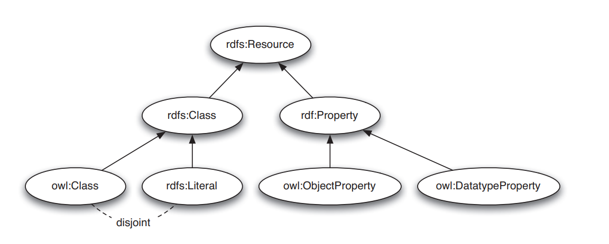

# Chapter 4
# Ngôn Ngữ Bản Thể Học Web: OWL2

**Tables of contents:**  
- [**4.1 Giới thiệu**](#41-giới-thiệu)  
- [**4.2 Yêu cầu đối với những Ngôn Ngữ Bản Thể Học**](#42-yêu-cầu-đối-với-những-ngôn-ngữ-bản-thể-học)  
	- **4.2.1 Cú pháp**  
	- **4.2.2 Ngữ nghĩa học chính thức**  
	- **4.2.3 Sự thể hiện**  
	- **4.2.4. Hỗ trợ suy luận**  
- [**4.3 Khả năng tương thích của OWL2 với RDF/RDFS**](#43-khả-năng-tương-thích-của-owl2-với-rdfrdfs)  
	- **4.3.1 Hai ngữ nghĩa**  
- [**4.4 Ngôn ngữ OWL**](#44-ngôn-ngữ-owl)  
	- 
---
# 4.1 Giới thiệu
Sự đa dạng của những điều mà ta có thể nói trong RDF và RDF Schema mà ta đã thảo luận trong những chương trước là rất hạn chế. RDF (gần như) giới hạn đối với các vị từ nhị phân cơ bản (binary ground predicates) và RDF Schema (gần như) giới hạn với một hệ thống phân cấp lớp con và thuộc tính, với miền và phạm vi xác định những thuộc tính này. Những ngôn ngữ được thiết kế với sự linh hoạt trong suy nghĩ.  
Tuy nhiên, trong vài trường hợp ta cần mô tả tri thức nâng cao hơn, tốn kém hơn - ví dụ, tất cả mọi người đều chỉ có một ngày sinh hay là một người không thể vừa là nam vừa là nữ.  
OWL2, Ngôn Ngữ Bản Thể Học Web, có liên quan chặt chẽ đến một phân đoạn của họ logic học được thiết kế đặc biệt để thể hiện kiến thức thuật ngữ.  

# 4.2 Yêu cầu đối với những Ngôn Ngữ Bản Thể Học
Ta đã thấy rằng RDF và RDFS cho phép ta mô tả các lớp, hay 'các khái niệm' tồn tại trong một miền và chia sẻ những mô tả đó qua các web. Một đặc tả chính thức rõ ràng về các khái niệm trong một miền học là *bản thể học (ontology)*. Các ngôn ngữ cho phép ta mô tả những bản thể học thì được gọi là *ngôn ngữ bản thể học (ontology language)*. Những yêu cầu chính với những ngôn ngữ đó là: một cú pháp được xác định rõ ràng, một ngữ nghĩa học chính thức, đủ sức biểu đạt, biểu đạt thuận tiện và hỗ trợ lập luận hiệu quả.  

## 4.2.1 Cú pháp
Tầm quan trọng của một *cú pháp được định nghĩa rõ ràng* là dễ thấy và được biết đến từ lĩnh vực ngôn ngữ lập trình; nó là một điều kiện cần thiết để máy xử lý thông tin. Một cú pháp được xác định rõ ràng nếu ta có thể sử dụng nó để mô tả mọi thứ mà một ngôn ngữ cho phép ta diễn đạt một cách rõ ràng. Như ta thấy, OWL2 xây dựng dựa trên RDF và RDFS và sử dụng một phần mở rộng cú pháp của chúng.  
Một cú pháp được định nghĩa rõ ràng không nhất thiết phải thân thiện với người dùng. Ví dụ, cú pháp RDF/XML thực sự khó cho con người có thể đọc. Tuy nhiên, nhược điểm này không đáng kể vì hầu hết các kỹ sư bản thể học sẽ sử dụng các công cụ phát triển bản thể học chuyên biệt, thay vì một trình soạn thảo, để xây dựng bản thể học.  

## 4.2.2 Ngữ nghĩa học chính thức
Một *ngữ nghĩa học chính thức (formal semantics)* mô tả chính xác ý nghĩa của một ngôn ngữ. *Chính xác* ở đây nghĩa là ngữ nghĩa không đề cập đến trực giác chủ quan, cũng không phải là những cách giải thích khác nhau của những người (hoặc máy móc) khác nhau. Tầm quan trọng của một ngữ nghĩa học chính thức đã được khẳng định rõ ràng trong lĩnh vực logic toán học.  
Sự kết hợp *ngữ nghĩa học chính thức* với một cú pháp được định nghĩa rõ ràng cho phép ta giải thích các câu được diễn đạt bằng cú pháp: giờ ta đã biết ý nghĩa của câu. Ngữ nghĩa chính thức cũng cho phép ta lập luận về kiến thức được thể hiện trong câu. Ví dụ, ngữ nghĩa chính thức của RDFS cho phép ta lập luận về *thành viên của lớp (class membership)*. Cho:  

*:x rdf:type &emsp; :C*  
*:C rdfs:subClassOf :D*  

ta có thể suy luận rằng :x là một instance của :D. Thuộc tính `rdfs:domain` và `rdfs:range` cho phép những suy luận tương tự:  

*:p rdfs:range :D*  
*:x :p&emsp;:y*  

cho phép ta suy luận rằng *:y rdf:type :D*.  

## 4.2.3 Thể hiện
Thật không may, sức mạnh thể hiện của RDF và RDFS là thực sự hạn chế trong vài lĩnh vực. Ta thường cần cung cấp các định nghĩa chính xác hơn thứ mà RDF và RDFS cho phép chúng ta phát biểu. Nếu ta xây dựng những bản thể học, ta có thể muốn có khả năng lý luận về:  
- **Thành viên của lớp** &emsp; Ta đã thấy rằng RDFS có vài cơ chế đơn giản cho việc xác định thành viên của lớp của các instance riêng lẻ bằng cách sử dụng lớp con, miền và phạm vi. Tuy nhiên, một mô tả chính xác hơn về các điều kiện trong một instance có thể được coi là thuộc về một lớp sẽ cho phép suy luận được chi tiết hơn. Ví dụ, nếu ta định nghĩa rằng vài cặp thuộc tính-giá trị xác định là một điều kiện phù hợp để trở thành một thành viên của một lớp *:A*, và nếu một instance *:x* thỏa mãn những điều kiện này, ta có thể kết luận rằng *:x* phải là một instance của *:A*: một đối tượng sẽ là một trận tennis nếu có quan hệ với người, vợt, ... .  
- **Phân lớp** Tương tự, ta sẽ muốn sử dụng điều kiện lên thành viên của lớp để suy luận mối quan hệ giữa các lớp với nhau. Ví dụ, một đinh nghĩa đơn giản về một trận tennis có thể được sử dụng lại cho một trận cầu lông.  
- **Tương đương (equivalence) và Bình đẳng (equality)** &emsp; Sẽ rất hữu ích để thể hiện sự *tương đương* giữa các lớp. Ví dụ, lớp :Tortoise chia sẻ tất cả thành viên của nó với lớp :Land_Turtle; do đó chúng tương đương nhau. Tương tự, ta sẽ muốn có thể phát biểu khi hai instance giống nhau: *:morning_star* và *:evening_start* là tên của cùng một hành tinh *:venus*; những instance này là giống nhau. Một lần nữa, có thể diễn đạt một cách trực tiếp thật tuyệt, nhưng nó cũng có thể xác định tính tương đương và bình đẳng bằng cách áp dụng ngữ nghĩa chính thức vào mô tả của các lớp.  
- **Sự rời rạc (Disjointness) và Khác biệt** &emsp; Tương tự, đôi khi ta biết rằng hai lớp không chia sẻ bất kì instance (chúng *rời rạc*) hoặc hai instance chắc chắn không phải cùng một thứ. Ví dụ: *:Winner* và *:Loser* là rời rạc, và *:roger_federer* và *:rafeal_nadal* là hai cá thể khác nhau.  
- **Kết hợp Boolean của các lớp** &emsp; Đôi khi các lớp cần được kết hợp theo những cách vượt ra ngoài quan hệ lớp con. Ví dụ, ta muốn định nghĩa lớp *:Person* là sự kết hợp rời rạc của các lớp *:Female* và *:Male*.  
- **Phạm vi cục bộ của thuộc tính** &emsp; *rdfs:range* chỉ ra những instance nằm trong phạm vị của thuộc một thuộc tính, nói rằng *:plays*, tất cả đều thuộc về một lớp nhất định. Do đó, trong RDFS ta không thể định nghĩa giới hạn phạm vi phân biệt giữa các ngữ cảnh. Ví dụ, ta không thể nói rằng tuyển thủ tennis chỉ chơi tennis, trong khi những người khác chơi cầu lông.  
- **Những đặc điểm đặc biệt của thuộc tính** &emsp; Đôi khi nó sẽ thực sự hữu ích khi một thuộc tính có *tính bắc cầu*, ví dụ như :greater_than; *độc nhất* như :is_mother_of; hoặc *nghịch đảo* của một thuộc tính khác như là :eats và :is_eaten_by.  
- **Hạn chế về số lượng** &emsp; Đôi khi ta cần đặt vài hạn chế với việc có bao nhiêu giá trị khác nhau mà một thuộc tính có thể hoặc phải nhận. Ví dụ như, mỗi người chỉ có một bố và một mẹ, và một khóa học được dạy bởi ít nhất một giảng viên.  
- **Tính nhất quán** &emsp; Một khi ta có thể xác định các mối quan hệ giữa các lớp, ta cũng sẽ muốn xác định xung đột giữa nhưng định nghĩa của chúng. Giả sử ta có một khai báo rằng :Fish và :Mammal là những lớp rời rạc. Sau đó sẽ là một sai lầm khi :dolphin là một instance của cả hai. Một ngôn ngữ bản thể học đủ sức biểu đạt sẽ cho phép ta phát hiện ra những kiểu mâu thuẫn này.  
  
Cuối cùng, một ngôn ngữ bản thể học cần tạo được điều kiện *thuận lợi* nhất có thể để xây dựng câu sử dụng các khả năng diễn đạt của nó. Ví dụ, một ngôn ngữ không quá thuận tiện nếu ta cần phải nhắc lại toàn bộ định nghĩa mỗi khi ta muốn tuyên bố rằng hai lớp là tương đương.  

## 4.2.4. Hỗ trợ lập luận
Ngữ nghĩa chính thức là một điều kiện tiên quyết hỗ trợ lập luận. Các dẫn xuất như những cái trước đó có thể thực hiện bằng máy móc thay vì bằng tay. Lập luận tự động quan trọng bởi vì nó cho phép chúng ta kiểm tra sự đúng đắn của bản thể học. Ví dụ:  
- Kiểm tra tính nhất quán của bản thể học  
- Kiểm tra các mối quan hệ ngoài ý muốn giữa các lớp  
- Kiểm tra các phân loại ngoài ý muốn của các trường lớp  

Hỗ trợ suy luận tự động cho phép người ta kiểm tra nhiều trường hợp hơn là kiểm tra thủ công. Các bước kiểm tra như những cách trước là cực kỳ có giá trị để thiết kế các bản thể học lớn, đối với các trường hợp có nhiều tác giả tham gia, để tích hợp và chia sẻ các bản thể học từ nhiều nguồn khác nhau.  
Chúng ta có thể cung cấp hỗ trợ ngữ nghĩa chính thức và hỗ trợ lập luận cho một ngôn ngữ bản thể học bằng việc ánh xạ nó tới một hình thức logic đã biết và bằng cách sử dụng các trình lập luận tự động đã tồn tại các hình thức đó.  
Rõ ràng chúng ta cần một ngôn ngữ bản thể học phong phú hơn RDF Schema, một ngôn ngữ cung những tính năng này và hơn thế nữa. Khi thiết kế một ngôn ngữ như vậy, ta nên nhận thức được sự cân bằng giữa sức mạnh diễn đạt và hỗ trợ lập luận hiệu quả. Nói chung, hình thức logic càng phong phú, hỗ trợ lý luận càng trở nên kém hiệu quả, thường xuyên qua biên giới của khả năng phân hủy (decidability); nghĩa là, lý luận về logic như vậy không được đảm bảo chấm dứt. Do đó, chúng ta cần một sự thỏa hiệp, một ngôn ngữ có thể được hỗ trợ bởi những trình suy luận hiệu quả một cách hợp lý, đồng thời đủ biểu đạt để thể hiện một lượng lớn kiến thức.  

# 4.3 Khả năng tương thích của OWL2 với RDF/RDFS
OWL2 là một phần mở rộng của RDF Schema, theo nghĩa là OWL2 sử dụng ý nghĩa RDFS của các lớp và thuộc tính (rdfs:Class, rdfs:subClass, ...) và thêm các nguyễn mẫu ngôn ngữ (language primitives) để hỗ trợ mức độ biểu cảm phong phú hơn cần thiết. Cách tiếp cận này sẽ phù hợp với kiến trúc phân lớp của Mạng Ngữ Nghĩa.  
Thật không may, chỉ cần mở rộng RDF Schema sẽ hoạt động chống lại việc đạt được sức mạnh biểu đạt và lập luận hiệu quả. RDF Schema có một số nguyễn thủy mô hình hóa rất mạnh mẽ. Các cấu trúc như là rdfs:Class (lớp của các lớp) và rdfs:Property (lớp của các thuộc tính) rất hàm ý (expressive) và sẽ dẫn đến các thuộc tính tính toán không thể kiểm soát nếu logic cơ bản OWL2 bao gồm các nguyễn mẫu này trong tính tổng quát của chúng.  

## 4.3.1 Hai ngữ nghĩa (Two Semantics)
Tập hợp đầy đủ các yêu cầu cho ngôn ngữ bản thể học dường như không thể đạt được: hỗ trợ lập luận hiệu quả không tồn tại đối với một ngôn ngữ biểu đạt như sự kết hợp của RDF với một logic đầy đủ. Thật vậy, những yêu cầu này đã thúc đẩy W3C chia OWL2 thành hai ngôn ngữ con khác nhau, mỗi ngôn ngữ có một ngữ nghĩa cơ bản khác nhau nhằm đáp ứng các khía cạnh khác nhau của tập hợp đầy đủ các yêu cầu.  

### 4.3.1.1 OWL2 Full: Ngữ nghĩa dựa trên RDF (RDF-Based Semantics)
Toàn bộ ngôn ngữ được gọi là OWL2 Full và sử dụng tất cả nguyễn mẫu ngôn ngữ OWL2. Nó cũng cho phép kết hợp những nguyễn mẫu một cách tùy ý với RDF và RDF Schema. Nó cũng bao gồm khả năng thay đổi ý nghĩa của các nguyên mẫu được xác định trước (RDF hoặc OWL2) bằng cách áp dụng các nguyễn mẫu ngôn ngữ cho nhau. Ví dụ trong OWL2 Full, ta có thể áp đặt một ràng buộc về số lượng đối với lớp của tất cả các lớp, về cơ bản giới hạn số lượng của các lớp có thể mô tả tại bất kỳ bản thể học.  
Ưu điểm của OWL2 Full là nó được ánh xạ tới *ngữ nghĩa dựa trên RDF*. Do đó, nó tương thích hoàn toàn về mặt cấu trúc và ngữ nghĩa trở lên với RDF: bấy kỳ tài liệu RDF hợp lệ nào cũng là tài liệu đầy đủ OWL2 hợp lệ và bất kỳ suy luận RDF Schema hợp lệ nào cũng là một kết luận OWL2 Full hợp lệ. Nhược điểm của OWL2 Full là ngôn ngữ đã trở nên mạnh mẽ đến mức không thể quyết định được, làm tiêu tan mọi hy vọng về hỗ trợ lý luận hoàn chỉnh (hoặc hiệu quả).  

### 4.3.1.2 OWL2 DL: Ngữ nghĩa trực tiếp
Để đem lại được hiệu quả tính toán, ngôn ngữ con thứ hai OWL2 DL được ánh xa vào một logic mô tả (Description Logic - DL). Logic mô tả là một tập con của logic vị từ với tác dụng làm cho việc hỗ trợ lập luận hiệu quả trở nên khả thi. OWL2 DL hạn chế cách thức sử dụng các nguyễn mẫu của OWL2, RDF và RDFS. Một vài hạn chế là:  
- OWL2 DL không cho phép áp dụng các nguyễn mẫu của OWL2 cho nhau.  
- OWL2 DL chỉ có thể định nghĩa các lớp tài nguyên bất trực nghĩa (non-literal resources). Tất cả các lớp OWL2 DL là một instance của *owl:Class* hơn là *rdfs:Class*.  
- OWL2 DL phân biệt chặt chẽ các thuộc tính mà phạm vi bao gồm các tài nguyên không theo trực nghĩa với các thuộc tính liên quan đến các giá trị trực nghĩa. Tất cả thuộc tính OWL2 là instance của *owl:ObjectProperty* hoặc owl:DatatypeProperty nhưng không đồng thời là cả hai.  
- Trong OWL2 DL một tài nguyên không thể đồng thời là một lớp, một thuộc tính hoặc là một instance. Chúng có thể có cùng tên (điều này được gọi là *chơi chữ (punning)*) nhưng sẽ luôn luôn được coi như là những thứ khác biệt bởi logic cơ bản.  

Các hạn chế trên đảm bảo rằng ngôn ngữ duy trì sự tương ứng trực tiếp của nó với một logic mô tả đã được hiểu rõ. Mô hình dưới đây chỉ ra những mối quan hệ của lớp con giữa một vài mô hình nguyễn mẫu của OWL2 và RDF/RDFS:  
  

Điểm vượt trội của khả năng diễn đạt hạn chế này là nó cho phép hỗ trợ lập luận hiệu quả. OWL2 DL có thể sử dụng một loạt các trình suy luận hiện có như Pellet, FaCT, RACER và HermiT. Khuyết điểm là chúng ta mất đi sự tương thích đầy đủ với RDF. Một tài liệu RDF nói chung sẽ được mở rộng theo một số khía cạnh và bị hạn chế ở những khía cạnh khác trước khi nó là một tài liệu OWL2 DL hợp lệ. Tuy nhiên, mỗi tài liệu OWL2 DL hợp lệ sẽ là một tài liệu RDF hợp lệ.  

Một trong những mục đích chính đằng sau kiến trúc phân lớp của Mạng Ngữ Nghĩa là khả năng tương thích thấp với việc tái sử dụng phần mềm tương ứng trên nhiều lớp khác nhau. Tuy nhiên, lợi thế của khả năng tương thích bị giảm xuống đối với OWL2 (bất kỳ bộ xử lý nhận biết OWL2 nào cũng sẽ cung cấp các diễn giải chính xác của bất kỳ tài liệu RDF Schema nào) chỉ đạt được với OWL2 Full, với chi phí khả năng khó tính toán.  

# 4.4 Ngôn ngữ OWL

Phần này giới thiệu về các nguyên mẫu ngôn ngữ của OWL2. Do có mối liên hệ chặt chẽ với logic hình thức, nên việc sử dụng một số thuật ngữ liên quan sẽ rất thuận tiện:  
- Trong OWL2, các thành viên của các lớp thường được gọi là *các cá thể (individuals)* hơn là *các instance*, nhưng ta sẽ sử dụng cả hai thuật ngữ luân phiên.  
- Khi chúng ta phát biểu rằng tài nguyên nào đó thuộc một kiểu nhất định, ta gọi đó là một *xác nhận (assertion)*.  
&ensp; Ví dụ:  
&ensp; *:roger_federer rdf:type :Person.*  
&ensp; là một *xác nhận lớp* liên kết *cá thể* :roger federer với lớp của nó.  
- Khi ta kết hợp các lớp, các thuộc tính và instance, chúng sẽ tạo thành *các biểu thức (expressions)*. Ví dụ:  
&ensp; *_:x rdf:type owl:Class;*  
&ensp; *&emsp; owl:unionOf (:Man :Woman).*  
&ensp; là một *biểu thức lớp* chỉ định sự kết hợp giữa lớp :Man và lớp :Woman.  
- Sau đó chúng ta liên hệ những định nghĩa này tới một trong số các lớp của chúng ta, ta tạo ra một *tiên đề (axiom)*. Ví dụ:  
&ensp; *:Person owl:equivalentClass _:x.*  
&ensp; *_:x rdf:type owl:Class;*  
&ensp; *&emsp; owl:unionOf (:Man :Woman).*  
&ensp; là một *tiên đề* lớp tương đương phát biểu rằng lớp :Person là tương đương kết hợp ta mô tả ở dưới. Các tiên đề lớp đôi khi được gọi là *các hạn chế*, vì chúng rằng buộc tập hợp của các cá thể thứ có thể là một thành viên của một lớp.  

