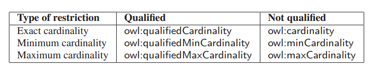

# Chapter 4
# Ngôn Ngữ Bản Thể Học Web: OWL2

**Tables of contents:**  
- [**4.1 Giới thiệu**](#41-giới-thiệu)  
- [**4.2 Yêu cầu đối với những Ngôn Ngữ Bản Thể Học**](#42-yêu-cầu-đối-với-những-ngôn-ngữ-bản-thể-học)  
	- **4.2.1 Cú pháp**  
	- **4.2.2 Ngữ nghĩa học chính thức**  
	- **4.2.3 Sự thể hiện**  
	- **4.2.4. Hỗ trợ suy luận**  
- [**4.3 Khả năng tương thích của OWL2 với RDF/RDFS**](#43-khả-năng-tương-thích-của-owl2-với-rdfrdfs)  
	- **4.3.1 Hai ngữ nghĩa**  
- [**4.4 Ngôn ngữ OWL**](#44-ngôn-ngữ-owl)  
	- **4.4.1 Cú pháp**  
	- **4.4.2 Những tài liệu bản thể học**  
	- **4.4.3 Các kiểu thuộc tính**  
	- **4.4.4 Các tiên đề thuộc tính**  
	- **4.4.5 Tiên đề lớp**  
	- **4.4.6 Tiên đề lớp về thuộc tính**  
	- 
---
# 4.1 Giới thiệu
Sự đa dạng của những điều mà ta có thể nói trong RDF và RDF Schema mà ta đã thảo luận trong những chương trước là rất hạn chế. RDF (gần như) giới hạn đối với các vị từ nhị phân cơ bản (binary ground predicates) và RDF Schema (gần như) giới hạn với một hệ thống phân cấp lớp con và thuộc tính, với miền và phạm vi xác định những thuộc tính này. Những ngôn ngữ được thiết kế với sự linh hoạt trong suy nghĩ.  
Tuy nhiên, trong vài trường hợp ta cần mô tả tri thức nâng cao hơn, tốn kém hơn - ví dụ, tất cả mọi người đều chỉ có một ngày sinh hay là một người không thể vừa là nam vừa là nữ.  
OWL2, Ngôn Ngữ Bản Thể Học Web, có liên quan chặt chẽ đến một phân đoạn của họ logic học được thiết kế đặc biệt để thể hiện kiến thức thuật ngữ.  

# 4.2 Yêu cầu đối với những Ngôn Ngữ Bản Thể Học
Ta đã thấy rằng RDF và RDFS cho phép ta mô tả các lớp, hay 'các khái niệm' tồn tại trong một miền và chia sẻ những mô tả đó qua các web. Một đặc tả chính thức rõ ràng về các khái niệm trong một miền học là *bản thể học (ontology)*. Các ngôn ngữ cho phép ta mô tả những bản thể học thì được gọi là *ngôn ngữ bản thể học (ontology language)*. Những yêu cầu chính với những ngôn ngữ đó là: một cú pháp được xác định rõ ràng, một ngữ nghĩa học chính thức, đủ sức biểu đạt, biểu đạt thuận tiện và hỗ trợ lập luận hiệu quả.  

## 4.2.1 Cú pháp
Tầm quan trọng của một *cú pháp được định nghĩa rõ ràng* là dễ thấy và được biết đến từ lĩnh vực ngôn ngữ lập trình; nó là một điều kiện cần thiết để máy xử lý thông tin. Một cú pháp được xác định rõ ràng nếu ta có thể sử dụng nó để mô tả mọi thứ mà một ngôn ngữ cho phép ta diễn đạt một cách rõ ràng. Như ta thấy, OWL2 xây dựng dựa trên RDF và RDFS và sử dụng một phần mở rộng cú pháp của chúng.  
Một cú pháp được định nghĩa rõ ràng không nhất thiết phải thân thiện với người dùng. Ví dụ, cú pháp RDF/XML thực sự khó cho con người có thể đọc. Tuy nhiên, nhược điểm này không đáng kể vì hầu hết các kỹ sư bản thể học sẽ sử dụng các công cụ phát triển bản thể học chuyên biệt, thay vì một trình soạn thảo, để xây dựng bản thể học.  

## 4.2.2 Ngữ nghĩa học chính thức
Một *ngữ nghĩa học chính thức (formal semantics)* mô tả chính xác ý nghĩa của một ngôn ngữ. *Chính xác* ở đây nghĩa là ngữ nghĩa không đề cập đến trực giác chủ quan, cũng không phải là những cách giải thích khác nhau của những người (hoặc máy móc) khác nhau. Tầm quan trọng của một ngữ nghĩa học chính thức đã được khẳng định rõ ràng trong lĩnh vực logic toán học.  
Sự kết hợp *ngữ nghĩa học chính thức* với một cú pháp được định nghĩa rõ ràng cho phép ta giải thích các câu được diễn đạt bằng cú pháp: giờ ta đã biết ý nghĩa của câu. Ngữ nghĩa chính thức cũng cho phép ta lập luận về kiến thức được thể hiện trong câu. Ví dụ, ngữ nghĩa chính thức của RDFS cho phép ta lập luận về *thành viên của lớp (class membership)*. Cho:  

*:x rdf:type &emsp; :C*  
*:C rdfs:subClassOf :D*  

ta có thể suy luận rằng :x là một instance của :D. Thuộc tính `rdfs:domain` và `rdfs:range` cho phép những suy luận tương tự:  

*:p rdfs:range :D*  
*:x :p&emsp;:y*  

cho phép ta suy luận rằng *:y rdf:type :D*.  


## 4.2.3 Thể hiện
Thật không may, sức mạnh thể hiện của RDF và RDFS là thực sự hạn chế trong vài lĩnh vực. Ta thường cần cung cấp các định nghĩa chính xác hơn thứ mà RDF và RDFS cho phép chúng ta phát biểu. Nếu ta xây dựng những bản thể học, ta có thể muốn có khả năng lý luận về:  
- **Thành viên của lớp** &emsp; Ta đã thấy rằng RDFS có vài cơ chế đơn giản cho việc xác định thành viên của lớp của các instance riêng lẻ bằng cách sử dụng lớp con, miền và phạm vi. Tuy nhiên, một mô tả chính xác hơn về các điều kiện trong một instance có thể được coi là thuộc về một lớp sẽ cho phép suy luận được chi tiết hơn. Ví dụ, nếu ta định nghĩa rằng vài cặp thuộc tính-giá trị xác định là một điều kiện phù hợp để trở thành một thành viên của một lớp *:A*, và nếu một instance *:x* thỏa mãn những điều kiện này, ta có thể kết luận rằng *:x* phải là một instance của *:A*: một đối tượng sẽ là một trận tennis nếu có quan hệ với người, vợt, ... .  
- **Phân lớp** Tương tự, ta sẽ muốn sử dụng điều kiện lên thành viên của lớp để suy luận mối quan hệ giữa các lớp với nhau. Ví dụ, một đinh nghĩa đơn giản về một trận tennis có thể được sử dụng lại cho một trận cầu lông.  
- **Tương đương (equivalence) và Bình đẳng (equality)** &emsp; Sẽ rất hữu ích để thể hiện sự *tương đương* giữa các lớp. Ví dụ, lớp :Tortoise chia sẻ tất cả thành viên của nó với lớp :Land_Turtle; do đó chúng tương đương nhau. Tương tự, ta sẽ muốn có thể phát biểu khi hai instance giống nhau: *:morning_star* và *:evening_start* là tên của cùng một hành tinh *:venus*; những instance này là giống nhau. Một lần nữa, có thể diễn đạt một cách trực tiếp thật tuyệt, nhưng nó cũng có thể xác định tính tương đương và bình đẳng bằng cách áp dụng ngữ nghĩa chính thức vào mô tả của các lớp.  
- **Sự rời rạc (Disjointness) và Khác biệt** &emsp; Tương tự, đôi khi ta biết rằng hai lớp không chia sẻ bất kì instance (chúng *rời rạc*) hoặc hai instance chắc chắn không phải cùng một thứ. Ví dụ: *:Winner* và *:Loser* là rời rạc, và *:roger_federer* và *:rafeal_nadal* là hai cá thể khác nhau.  
- **Kết hợp Boolean của các lớp** &emsp; Đôi khi các lớp cần được kết hợp theo những cách vượt ra ngoài quan hệ lớp con. Ví dụ, ta muốn định nghĩa lớp *:Person* là sự kết hợp rời rạc của các lớp *:Female* và *:Male*.  
- **Phạm vi cục bộ của thuộc tính** &emsp; *rdfs:range* chỉ ra những instance nằm trong phạm vị của thuộc một thuộc tính, nói rằng *:plays*, tất cả đều thuộc về một lớp nhất định. Do đó, trong RDFS ta không thể định nghĩa giới hạn phạm vi phân biệt giữa các ngữ cảnh. Ví dụ, ta không thể nói rằng tuyển thủ tennis chỉ chơi tennis, trong khi những người khác chơi cầu lông.  
- **Những đặc điểm đặc biệt của thuộc tính** &emsp; Đôi khi nó sẽ thực sự hữu ích khi một thuộc tính có *tính bắc cầu*, ví dụ như :greater_than; *độc nhất* như :is_mother_of; hoặc *nghịch đảo* của một thuộc tính khác như là :eats và :is_eaten_by.  
- **Hạn chế về số lượng** &emsp; Đôi khi ta cần đặt vài hạn chế với việc có bao nhiêu giá trị khác nhau mà một thuộc tính có thể hoặc phải nhận. Ví dụ như, mỗi người chỉ có một bố và một mẹ, và một khóa học được dạy bởi ít nhất một giảng viên.  
- **Tính nhất quán** &emsp; Một khi ta có thể xác định các mối quan hệ giữa các lớp, ta cũng sẽ muốn xác định xung đột giữa nhưng định nghĩa của chúng. Giả sử ta có một khai báo rằng :Fish và :Mammal là những lớp rời rạc. Sau đó sẽ là một sai lầm khi :dolphin là một instance của cả hai. Một ngôn ngữ bản thể học đủ sức biểu đạt sẽ cho phép ta phát hiện ra những kiểu mâu thuẫn này.  
  
Cuối cùng, một ngôn ngữ bản thể học cần tạo được điều kiện *thuận lợi* nhất có thể để xây dựng câu sử dụng các khả năng diễn đạt của nó. Ví dụ, một ngôn ngữ không quá thuận tiện nếu ta cần phải nhắc lại toàn bộ định nghĩa mỗi khi ta muốn tuyên bố rằng hai lớp là tương đương.  

## 4.2.4. Hỗ trợ lập luận
Ngữ nghĩa chính thức là một điều kiện tiên quyết hỗ trợ lập luận. Các dẫn xuất như những cái trước đó có thể thực hiện bằng máy móc thay vì bằng tay. Lập luận tự động quan trọng bởi vì nó cho phép chúng ta kiểm tra sự đúng đắn của bản thể học. Ví dụ:  
- Kiểm tra tính nhất quán của bản thể học  
- Kiểm tra các mối quan hệ ngoài ý muốn giữa các lớp  
- Kiểm tra các phân loại ngoài ý muốn của các trường lớp  

Hỗ trợ suy luận tự động cho phép người ta kiểm tra nhiều trường hợp hơn là kiểm tra thủ công. Các bước kiểm tra như những cách trước là cực kỳ có giá trị để thiết kế các bản thể học lớn, đối với các trường hợp có nhiều tác giả tham gia, để tích hợp và chia sẻ các bản thể học từ nhiều nguồn khác nhau.  
Chúng ta có thể cung cấp hỗ trợ ngữ nghĩa chính thức và hỗ trợ lập luận cho một ngôn ngữ bản thể học bằng việc ánh xạ nó tới một hình thức logic đã biết và bằng cách sử dụng các trình lập luận tự động đã tồn tại các hình thức đó.  
Rõ ràng chúng ta cần một ngôn ngữ bản thể học phong phú hơn RDF Schema, một ngôn ngữ cung những tính năng này và hơn thế nữa. Khi thiết kế một ngôn ngữ như vậy, ta nên nhận thức được sự cân bằng giữa sức mạnh diễn đạt và hỗ trợ lập luận hiệu quả. Nói chung, hình thức logic càng phong phú, hỗ trợ lý luận càng trở nên kém hiệu quả, thường xuyên qua biên giới của khả năng phân hủy (decidability); nghĩa là, lý luận về logic như vậy không được đảm bảo chấm dứt. Do đó, chúng ta cần một sự thỏa hiệp, một ngôn ngữ có thể được hỗ trợ bởi những trình suy luận hiệu quả một cách hợp lý, đồng thời đủ biểu đạt để thể hiện một lượng lớn kiến thức.  

# 4.3 Khả năng tương thích của OWL2 với RDF/RDFS
OWL2 là một phần mở rộng của RDF Schema, theo nghĩa là OWL2 sử dụng ý nghĩa RDFS của các lớp và thuộc tính (rdfs:Class, rdfs:subClass, ...) và thêm các nguyên mẫu ngôn ngữ (language primitives) để hỗ trợ mức độ biểu cảm phong phú hơn cần thiết. Cách tiếp cận này sẽ phù hợp với kiến trúc phân lớp của Mạng Ngữ Nghĩa.  
Thật không may, chỉ cần mở rộng RDF Schema sẽ hoạt động chống lại việc đạt được sức mạnh biểu đạt và lập luận hiệu quả. RDF Schema có một số nguyễn thủy mô hình hóa rất mạnh mẽ. Các cấu trúc như là rdfs:Class (lớp của các lớp) và rdfs:Property (lớp của các thuộc tính) rất hàm ý (expressive) và sẽ dẫn đến các thuộc tính tính toán không thể kiểm soát nếu logic cơ bản OWL2 bao gồm các nguyên mẫu này trong tính tổng quát của chúng.  

## 4.3.1 Hai ngữ nghĩa (Two Semantics)
Tập hợp đầy đủ các yêu cầu cho ngôn ngữ bản thể học dường như không thể đạt được: hỗ trợ lập luận hiệu quả không tồn tại đối với một ngôn ngữ biểu đạt như sự kết hợp của RDF với một logic đầy đủ. Thật vậy, những yêu cầu này đã thúc đẩy W3C chia OWL2 thành hai ngôn ngữ con khác nhau, mỗi ngôn ngữ có một ngữ nghĩa cơ bản khác nhau nhằm đáp ứng các khía cạnh khác nhau của tập hợp đầy đủ các yêu cầu.  

### 4.3.1.1 OWL2 Full: Ngữ nghĩa dựa trên RDF (RDF-Based Semantics)
Toàn bộ ngôn ngữ được gọi là OWL2 Full và sử dụng tất cả nguyên mẫu ngôn ngữ OWL2. Nó cũng cho phép kết hợp những nguyên mẫu một cách tùy ý với RDF và RDF Schema. Nó cũng bao gồm khả năng thay đổi ý nghĩa của các nguyên mẫu được xác định trước (RDF hoặc OWL2) bằng cách áp dụng các nguyên mẫu ngôn ngữ cho nhau. Ví dụ trong OWL2 Full, ta có thể áp đặt một ràng buộc về số lượng đối với lớp của tất cả các lớp, về cơ bản giới hạn số lượng của các lớp có thể mô tả tại bất kỳ bản thể học.  
Ưu điểm của OWL2 Full là nó được ánh xạ tới *ngữ nghĩa dựa trên RDF*. Do đó, nó tương thích hoàn toàn về mặt cấu trúc và ngữ nghĩa trở lên với RDF: bấy kỳ tài liệu RDF hợp lệ nào cũng là tài liệu đầy đủ OWL2 hợp lệ và bất kỳ suy luận RDF Schema hợp lệ nào cũng là một kết luận OWL2 Full hợp lệ. Nhược điểm của OWL2 Full là ngôn ngữ đã trở nên mạnh mẽ đến mức không thể quyết định được, làm tiêu tan mọi hy vọng về hỗ trợ lý luận hoàn chỉnh (hoặc hiệu quả).  

### 4.3.1.2 OWL2 DL: Ngữ nghĩa trực tiếp
Để đem lại được hiệu quả tính toán, ngôn ngữ con thứ hai OWL2 DL được ánh xa vào một logic mô tả (Description Logic - DL). Logic mô tả là một tập con của logic vị từ với tác dụng làm cho việc hỗ trợ lập luận hiệu quả trở nên khả thi. OWL2 DL hạn chế cách thức sử dụng các nguyên mẫu của OWL2, RDF và RDFS. Một vài hạn chế là:  
- OWL2 DL không cho phép áp dụng các nguyên mẫu của OWL2 cho nhau.  
- OWL2 DL chỉ có thể định nghĩa các lớp tài nguyên bất trực nghĩa (non-literal resources). Tất cả các lớp OWL2 DL là một instance của *owl:Class* hơn là *rdfs:Class*.  
- OWL2 DL phân biệt chặt chẽ các thuộc tính mà phạm vi bao gồm các tài nguyên không theo trực nghĩa với các thuộc tính liên quan đến các giá trị trực nghĩa. Tất cả thuộc tính OWL2 là instance của *owl:ObjectProperty* hoặc owl:DatatypeProperty nhưng không đồng thời là cả hai.  
- Trong OWL2 DL một tài nguyên không thể đồng thời là một lớp, một thuộc tính hoặc là một instance. Chúng có thể có cùng tên (điều này được gọi là *chơi chữ (punning)*) nhưng sẽ luôn luôn được coi như là những thứ khác biệt bởi logic cơ bản.  

Các hạn chế trên đảm bảo rằng ngôn ngữ duy trì sự tương ứng trực tiếp của nó với một logic mô tả đã được hiểu rõ. Mô hình dưới đây chỉ ra những mối quan hệ của lớp con giữa một vài mô hình nguyên mẫu của OWL2 và RDF/RDFS:  
  

Điểm vượt trội của khả năng diễn đạt hạn chế này là nó cho phép hỗ trợ lập luận hiệu quả. OWL2 DL có thể sử dụng một loạt các trình suy luận hiện có như Pellet, FaCT, RACER và HermiT. Khuyết điểm là chúng ta mất đi sự tương thích đầy đủ với RDF. Một tài liệu RDF nói chung sẽ được mở rộng theo một số khía cạnh và bị hạn chế ở những khía cạnh khác trước khi nó là một tài liệu OWL2 DL hợp lệ. Tuy nhiên, mỗi tài liệu OWL2 DL hợp lệ sẽ là một tài liệu RDF hợp lệ.  

Một trong những mục đích chính đằng sau kiến trúc phân lớp của Mạng Ngữ Nghĩa là khả năng tương thích thấp với việc tái sử dụng phần mềm tương ứng trên nhiều lớp khác nhau. Tuy nhiên, lợi thế của khả năng tương thích bị giảm xuống đối với OWL2 (bất kỳ bộ xử lý nhận biết OWL2 nào cũng sẽ cung cấp các diễn giải chính xác của bất kỳ tài liệu RDF Schema nào) chỉ đạt được với OWL2 Full, với chi phí khả năng khó tính toán.  

# 4.4 Ngôn ngữ OWL
Phần này giới thiệu về các nguyên mẫu ngôn ngữ của OWL2. Do có mối liên hệ chặt chẽ với logic hình thức, nên việc sử dụng một số thuật ngữ liên quan sẽ rất thuận tiện:  
- Trong OWL2, các thành viên của các lớp thường được gọi là *các cá thể (individuals)* hơn là *các instance*, nhưng ta sẽ sử dụng cả hai thuật ngữ luân phiên.  
- Khi chúng ta phát biểu rằng tài nguyên nào đó thuộc một kiểu nhất định, ta gọi đó là một *khẳng định (assertion)*.  
&ensp; Ví dụ:  
&ensp; *:roger_federer rdf:type :Person.*  
&ensp; là một *khẳng định lớp* liên kết *cá thể* :roger federer với lớp của nó.  
- Khi ta kết hợp các lớp, các thuộc tính và instance, chúng sẽ tạo thành *các biểu thức (expressions)*. Ví dụ:  
&ensp; *_:x rdf:type owl:Class;*  
&ensp; *&emsp; owl:unionOf (:Man :Woman).*  
&ensp; là một *biểu thức lớp* chỉ định sự kết hợp giữa lớp :Man và lớp :Woman.  
- Sau đó chúng ta liên hệ những định nghĩa này tới một trong số các lớp của chúng ta, ta tạo ra một *tiên đề (axiom)*. Ví dụ:  
&ensp; *:Person owl:equivalentClass _:x.*  
&ensp; *_:x rdf:type owl:Class;*  
&ensp; *&emsp; owl:unionOf (:Man :Woman).*  
&ensp; là một *tiên đề* lớp tương đương phát biểu rằng lớp :Person là tương đương kết hợp ta mô tả ở dưới. Các tiên đề lớp đôi khi được gọi là *các hạn chế*, vì chúng rằng buộc tập hợp của các cá thể thứ có thể là một thành viên của một lớp.  

Cần lưu ý rằng OWL2 về cơ bản là một ngôn ngữ để mô tả các tập hợp sự vật. Những tập hợp này được gọi là 'các lớp'. Mỗi một phát biểu ta tạo ra về một lớp trong OWL2 đều nhằm phân biệt lớp đó với tập hợp tất cả sự vật.  

## 4.4.1 Cú pháp
OWL2 xây dựng dựa trên RDF và RDF Schema do đó có thể được diễn đạt bằng việc sử dụng tất cả các cú pháp RDF hợp lệ. Tuy nhiên, có rất nhiều cú pháp dành cho OWL2, mỗi cái có một lợi ích và một nhược điểm riêng:  
- **Functionnal-Style Syntax**&emsp;Cú pháp này liên quan chặt chẽ đến cấu trúc chính thức của những bản thể học. Nó được sử dụng trong tài liệu đặc tả ngôn ngữ, trong những định nghĩa các ngữ nghĩa của các bản thể học OWL2, ánh xạ từ và tới các cú pháp RDF và các cấu hình khác nhau của OWL2. Chúng gọn nhẹ và dễ đọc hơn những cú pháp khác. Ví dụ, giới hạn lớp phía trên có thể được viết với cú pháp này như sau:  
&emsp;*EquivalentClasses( :Person ObjectUnionOf( :Man :Woman))*  

- **OWL/XML**&emsp;Đây là một cú pháp XML cho OWL2 nó không tuân theo quy tắc RDF, nhưng ánh xạ chặt chẽ với functional-style syntax. Lợi ích chính của cú pháp này là nó cho phép ta tương tác với những bản thể học sử dụng các công cụ soạn thảo XML tiêu chuẩn sẵn có. Ví dụ, cú pháp OWL/XML của tiên đề lớp tương đương là:  
&emsp;```xml
<EquivalentClasses>
	<Class abbreviatedIRI=":Person"/>
	<ObjectUnionOf>
		<Class IRI="#Man"/>
		<Class IRI="#Woman"/>
	</ObjectUnionOf>
</EquivalentClasses>
```  

- **Manchester Syntax**&emsp;Cú pháp này được thiết kế để con người có thể đọc được. Nó là cú pháp được sử dụng trong giao diện người dùng của phần lớn các phần mềm editor bản thể học như Protégé.  
&emsp; Class:Person  
&emsp; EquivalentTo: Man or Woman  

Ngoài những cú pháp này, tất cả cú pháp RDF có thể được sử dụng cho OWL.  

## 4.4.2 Những tài liệu bản thể học
Khi sử dụng cú pháp Turtle, những tài liệu bản thể học OWL2 hoặc *bản thể học*, tương tự như một tài liệu RDF. Các bản thể học OWL2 đem lại tối thiểu các tên không gian sau đây:  
*@prefix owl: <http://www.w3.org/2002/07/owl#>.*  
*@prefix rdf: <http://www.w3.org/1999/02/22-rdf-syntax-ns#>.*  
*@prefix rdfs: <http://www.w3.org/2000/01/rdf-schema#>.*  
*@prefix xsd: <http://www.w3.org/2001/XMLSchema#>.*  

Một bản thể học OWL2 bắt đầu với một tập hợp các khẳng định cho mục đích quản lý. Những khẳng định này giới thiệu một tên không gian cơ sở, bản thể học, tên của nó, có thể là bình luận, quản lý phiên bản và khai báo những bản thể học khác. Ví dụ như:  
```Turtle
@prefix : <http://www.semanticwebprimer.org/ontologies/apartments.ttl#>.
@prefix dbpedia-owl: <http://dbpedia.org/ontology/>.
@prefix dbpedia: <http://dbpedia.org/resource/>.
@base <http://www.semanticwebprimer.org/ontologies/apartments.ttl> .

<http://www.semanticwebprimer.org/ontologies/apartments.ttl>
	rdf:type owl:Ontology;
	rdfs:label "Apartments Ontology"^^xsd:string;
	rdfs:comment "An example OWL2 ontology"^^xsd:string;
	owl:versionIRI <http://www.semanticwebprimer.org/ontoligies/apartments.ttl#1.0>;
	owl:imports <http://dbpedia.org/ontology/>;
	owl:imports <http://dbpedia.org/resource/>.
```  

- **Imports**&emsp;Chỉ một trong những khẳng định này có ảnh hưởng đến ý nghĩa logic của bản thể học: *owl:imports* trỏ vào những bản thể học khác có tiên đề là một phần của bản thể học hiện tại. Bản thể học apartments của ta khai báo tất cả các tiên đề được định nghĩa trong bản thể học DBPedia, hay tất cả mọi thứ trong DBPedia. Điều này ngay lập tức làm nổi bật một trong những vấn đề với *owl:imports* để có thể sử dụng một số thông tin trong DBPedia, ta phải nhập tất cả 672 triệu bộ ba được mô tả trong nó.  
&emsp;Khi những tên không gian chỉ được sử dụng cho việc phân biệt, các bản thể học được khai báo cung cấp những định nghĩa có thể được sử dụng. Điển hình là một bản thể học chứa một phát biểu khai báo cho tất cả tên không gian mà nó sử dụng, nhưng nó có thể khai báo các bản thể học bổ sung - ví dụ, các bản thể học cung cấp các định nghĩa mà không đưa ra bất kỳ một cái tên mới này. Thuộc tính *owl:imports* có *tính bắc cầu*; nếu một bản thể học *O<sub>i</sub>* khai báo bản thể học O<sub>j</sub> và bản thể học O<sub>j</sub> khai báo bản thể học O<sub>k</sub> thì bản thể học O<sub>i</sub> cũng sẽ khai báo bản thể học O<sub>k</sub>.  

## 4.4.3 Các kiểu thuộc tính
Ta đã đề cập ở trước, OWL2 phân biệt hai kiểu thuộc tính: *object properties (Các thuộc tính đối tượng)* và *datatype properties (các thuộc tính kiểu dữ liệu)*. Trên thực tế, có một số đặc điểm của thuộc tính mà các loại bổ sung được cung cấp bởi OWL2. Ở phần này, ta sẽ nói ngắn gọn về từng loại:  
- **Object Properties (Thuộc tính đối tượng)**&emsp;Những thuộc tính này liên kết những cá thể với những cá thể khác. Ví dụ là :rents và :livesln:  
```Turtle
:rents	rdf:type 	owl:ObjectProperty;
	rdf:domain	:Person;
	rdfs:range	:Apartment;
	rdfs:subPropertyOf :livesln.
```  

- **Datatype Properties (Thuộc tính kiểu dữ liệu)**&emsp;Những thuộc tính liên kết các đối tượng với những giá trị trực nghĩa có kiểu dữ liệu nhất định. Ví dụ là :name và :age:  
```Turtle
:age	rdf:type 	owl:ObjectProperty;
	rdfs:range	xsd:nonNegativeInteger.
```  

Tương tự như RDF, OWL2 cho phép sử dụng những kiểu dữ liệu XML Schema để chỉ ra những kiểu của một trực nghĩa hoặc xác định phạm vi của một thuộc tính kiểu dữ liệu. Những kiểu dữ liệu được người dùng định nghĩa có thể được xác định trong một XML schema và sau đó được sử dụng trong một bản thể luận OWL2.  
Do những hạn chế trong ngữ nghĩa trực tiếp, trong số các loại thuộc tính sau, chỉ loại thuộc tính chức năng có thể được gán cho các thuộc tính kiểu dữ liệu trong OWL2DL.  

- **Annotation Properties (Thuộc tính chú thích)**&emsp;Thuộc tính chú thích là các thuộc tính không mang bất kỳ một ý nghĩa nào theo nghĩa trực tiếp của OWL2 DL. Chúng được bỏ qua bở một trình suy luận DL. Tuy nhiên, chúng sẽ được tính đến bở các trình suy luận RDF Schema và OWL2 Full. Các thuộc tính chú thích thường được sử dụng để thêm nhãn, nhận xét hoặc giải thích có thể đọc được vào bản thể học, lớp, thuộc tính và cá thể OWL2.  
```Turtle
:label	rdf:type	owl:AnnotationProperty.
	rdfs:range	rdf:PlainLiteral.
	rdfs:subPropertyOf rdf:label
:Apartment	:label	"Apartment"@en,
			"Apparrtement"@nl.
```  
&ensp;Có một số điều xảy ra ở ví dụ trên. Chúng ta đầu tiên khai báo thuộc tính :label thuộc loại owl:AnnotationProperty với phạm vi rdf:PlainLiteral. Đó là một kiểu dữ liệu RDF đặc biệt cho văn bản ngôn ngữ tự nhiên - nghĩa là, các trực nghĩa có thể có một thẻ ngôn ngữ. Hơn nữa, ta định nghĩa thuộc tính :label trở thành một thuộc tính con của rdf:label và sau đó ta đưa ra ba label cho lớp :Apartment bằng Tiếng Anh và Tiếng Hà Lan.  
&ensp;Trong trường hợp chung, các thuộc tính chú thích sẽ có các giá trị theo trực nghĩa, nhưng chúng cũng có thể được sử dụng để liên quan đến các tài nguyên không phải là chữ.  

- **Top và Bottom Properties (Thuộc tính trên dưới)**&emsp;Tất cả thuộc tính đối tượng trong OWL2 là một thuộc tính con của owl:topObjectProperty. Thuộc tính được định nghĩa như là một thuộc tính liên kết tất cả các cá thể trong bản thể học. Ngược lại, owl:bottomObjectProperty là một thuộc tính liên kết các bất cá thể. Tương tự, owl:topDataProperty liên kết tất cả các cá thể tới mọi giá trị trực nghĩa có thể và owl:bottomDataProperty liên kết bất cả thế tới mọi giá trị trực nghĩa.  

- **Transitive Properties (Thuộc tính bắc cầu)**&emsp;Từ những trao đổi về rdfs:subClassOf, ta biết rằng mối quan hệ này có *tính bắc cầu*; mỗi lớp là một lớp con của tất cả các lớp cha của lớp cha trực tiếp của nó. Rõ ràng có những quan hệ khác cũng có tính bắc cầu, chẳng hạn như :isPartOf hoặc :isCheperThan. Ta có thể định nghĩa một thuộc tính bắc cầu như sau:  
```Turtle
:isPartOf	rdf:type	owl:ObjectProperty;
	rdf:type	owl:TransitiveProperty.
```  

|**Khi nào là một thuộc tính hỗn hợp?**|  
|---|  
|- Top và Bottom Properties đều là những thuộc tính hỗn hợp|  
|- Bất kỳ thuộc tính nào tự có tính bắc cầu hoặc có thuộc tính nghịch đảo là thuộc tính bắc cầu|  
|- Bất kỳ thuộc tính nào có một thuộc tính con nghịch đảo hoặc một thuộc tính con mà nghịch đảo của nó có tính bắc|  
|- Bất kỳ thuộc tính nào là thuộc tính cha của một chuộc thuộc tính, hoặc là một thuộc tính đảo ngược của một thuộc tính của một thuộc tính cha của một chuỗi thuộc tính|  
|- Bất kỳ thuộc tính là một thuộc tính tương đương với một trong những thuộc tính trên, hoặc là một thuộc tính cha của một thuộc tính tương đương với một trong những thuộc tính trên.|  
|Thuộc tính tổng hợp đôi khi được gọi là vai trò phức hợp hoặc thuộc tính không đơn giản.|  

|**Các ràng buộc**|  
|---|  
|Thuộc tính tổng hợp có thể xảy ra với những tiên đề sau đây:|  
|- Hạn chế về số lượng đủ điều kiện và không đủ tiêu chuẩn đối với các lớp;|  
|- Giới hạn bản thân đối với các lớp,|  
|- Tiền đề thuộc tính rời rạc.|  
|Ngoài ra, chúng có thể không được chỉ định các loại thuộc tính sau:|  
|- Chức năng và chức năng nghịch đảo;|  
|- Không phả xa;|  
|- Không đối xứng.|  

Thuộc tính bắc cầu được gọi là thuộc tính hỗn hợp: chúng có thể được cho là bao gồm nhiều bước. Ví dụ, cho:  
```Turtle
:BaronWayApartment	:isPartOf	:BaronWayBuilding.
:BaronWayKitchen	:isPartOf	:BaronWayApartment.
```  
một trình suy luận sẽ đưa ra:  
```Turtle
:BaronWayApartment	:isPartOf	:BaronWayBuilding.
```  
Quan hệ cuối cùng :isPartOf này bao gồm hai khẳng định thuộc tính trước đó. Do tính kết hợp này, các thuộc tính bắc cầu phải tuân theo một số hạn chế được liệt kê trong bảng trên.  

**Symmetric and Asymmetric Properties (Thuộc tính đối xứng và không đối xứng)**&emsp;Vài thuộc tính như là :isAdjacentTo là một đối xứng; do đó nếu *a :isAdjacentTo b*, nghịch đảo cũng tương tự. Nói cách khác, thuộc tính đối xứng tương đương với nghịch đảo của nó. Với những thuộc tính khác, chúng ta biết rằng điều này sẽ không xảy ra. Ví dụ, quan hệ :isCheaperThan là một bất đối xứng.  
```Turtle
:isAdjacentTo	rdf:type	owl:ObjectProperty;
	rdf:type	owl:SymmetricProperty.

:isCheaperThan	rdf:type	owl:ObjectProperty;
	rdf:type	owl:AsymmetricProperty;
	rdf:type	owlTransitiveProperty.
```  

**Functional and Inverse-Functional Properties (Thuộc tính chức năng và chức năng nghịch đảo)**&emsp;Với một vài thuộc tính ta biết rằng mỗi cá thể luôn có thể có tối đa một cá thể khác được liên kết thông qua thuộc tính đó. Ví dụ :hasNumberOfRooms là một thuộc tính chức năng, và :hasRoom là thuộc tính chức năng nghịch đảo:  
```Turtle
:hasNumberOfRooms	rdf:type	owl:DatatypeProperty;
	rdf:type	owl:FunctionalProperty.

:hasRoom	rdf:type	owl:ObjectProperty;
	rdf:type	owl:InversèunctionalProperty.
```  

**Reflexive and Irreflexive Properties (Thuộc tính phản chiếu và không phản chiếu)**&emsp;Phản chiếu là một thuộc tính mà mỗi cá thể được liên kết thông qua thuộc tính đó với chính nó. Ví dụ, mọi thứ đều :isPartOf của chính nó. Không phản chiếu thì có ý nghĩa ngược lại, mọi cá thể không liên kết với chính nó thông qua thuộc tính đó. Đa phần các thuộc tính không chung miền và phạm vi thực chất đều là phản chiếu. Ví dụ như thuộc tính :rents:  
```Turtle
:isPartOf	rdf:type	owl:ObjectProperty;
	rdf:type	owl:ReflexiveProperty.

:rents	rdf:type	owl:ObjectProperty;
	rdf:type	owl:IrreflexiveProperty.
```  

## 4.4.4 Các tiên đề thuộc tính *

Ngoài các kiểu thuộc tính được thảo luận trong phần trước, chúng ta có thể khai báo các đặc trưng bổ sung của thuộc tính về cách chúng liên kết các lớp và các thuộc tính khác.  

**Miền và Phạm vi**&emsp;Việc OWL2 xử lý miền và phạm vi cho thuộc tính y hệt như RDF Schema. Nếu có nhiều hơn một rdfs:range hoặc rdfs:domain được khẳng định cho một thuộc tính, phạm vi và miền thật sự là giao điểm của các lớp được chỉ định trong tiên đề thuộc tính.  
&emsp;Một hiểu lầm thông thường là miền và phạm vi hoạt động như một ràng buộc với các kiểu của cá thể có thể liên kết thông qua một thuộc tính. Thực tế, các miền và phạm vi chỉ có thể được sử dụng để xác định tư cách thành viên lớp cho các cá thể. Đưa ra định nghĩa của :rents như sau, bất kì hai cá thể *p* và *a* mà *p :rents a* sẽ được phân loại là thành viên của :Person và :Apartment.  

**Inverse Properties (Thuộc tính nghịch đảo)**&emsp;OWL2 cho phép chúng ta định nghĩa nghịch đảo của các thuộc tính. Ví dụ như :rents và :isRentedBy:  
```Turtle
:isRentedBy	rdf:type	owl:ObjectProperty;
	owl:inverseOf	:rents.
```  
&emsp;Điều này nghĩa là một trình suy luận sẽ xác định rằng hai cá thể *p* và *m* có mối quan hệ *m :isRentedBy p* ngoài *p :rents m*. Miền và phạm vi kế thừa từ thuộc tính nghịch đảo :isRentedBy có :Person là phạm vi và :Apartment là miền. Trong OWL2 DL, chỉ có thuộc tính đối tượng với có nghịch đảo.  

**Equivalent Properties (Thuộc tính tương đương)**&emsp;Thuộc tính có thể được đĩnh nghĩa là tương đương. Do đó, mỗi hai cá thể liên kết qua một thuộc tính sẽ luôn luôn được liên kết qua tương đương của nó, và ngược lại. Tương đương là một cơ thế thuận tiện trong việc ánh xạ các thành phần của hai bản thể học với nhau. Ví dụ:  
```Turtle
:isPartOf	rdf:type	owl:ObjectProperty;
	owl:equivalentProperty	dbpedia:partOf.
```  

**Disjoin Properties (Thuộc tính rời rạc)**&emsp; Vài thuộc tính mà ta biết rằng không có hai cá thể liên kết qua một thuộc tính có thể liên kết qua những thuộc tính còn lại: Tập hợp của các cặp cá thể cho các thuộc tính có thể chứa là *rời rạc*. Ví dụ là :rents và :owns:  
```Turtle
:rents	rdf:type	owl:ObjectProperty;
	rdfs:domain	:Person;
	rdfs:range	:Apartment;
	owl:disjointProperty	:owns.
```  
&emsp;Dễ thấy, ta không thể thuê (rent) thứ là ta sở hữu (own). Lưu ý rằng theo ngữa nghĩa trực tiếp của OWL2 DL, owl:ObjectProperty và owl:DatatypeProperty là rời rạc.  

**Property Chains (Chuỗi thuộc tính)**&emsp;Một tính năng phức tạp hơn của OWL2 là khả năng khai báo các chuỗi thuộc tính. Đôi khi chúng có ích trong việc xác định đường tắt trong đồ thị thuộc tính liên kết với nhiều loại cá thể. Ví dụ, nếu ta biết rằng :Paul :rents :BaronWayApartment, và :BaronWayApartment :isPartOf :BaronWayBuilding, là thứ dbpedia:location :dbpedia:Amsterdam, ta biết rằng :Paul phải có một quan hệ :livesIn với :Amsterdam. Trong OWL2 ta có thể xác định điều này bằng việc sử dụng tiên đồ chuỗi thuộc tính:  
  
```Turtle
:livesln	rdf:type	owl:ObjectProperty;
	owl:propertyChainAxiom (:rents :isPartOf :location).  
```  
&emsp;Hình minh họa trên cho ta thấy sự tồn tại của :livesIn được suy ra từ ví dụ căn hộ. Lưu ý rằng, tiên đề chuỗi thuộc tính không làm cho thuộc tính được đặt tên (:livesln) tương đương với chuỗi thuộc tính; chính xác hơn nó là một thuộc tính con của chuỗi. Trong OWL2 DL, chuỗi thuộc tính chỉ có liên quan đến thuộc tính đối tượng, mặc dù hầu hết trình suy luận có thể xử lý chuỗi có một thuộc tính kiểu dữ liệu ở bước cuối cùng.  
&emsp;Bởi vì tính biểu đạt của chúng, các chuỗi thuộc tính phải chịu một số các giới hạn. Đầu tiên, tương tự như thuộc tính bắc đầu, thuộc tính cha của chuỗi thuộc tính là *hỗn hợp*. Nghĩa là chúng không thể được sử dụng trong một số tiên đề. Thứ hai, chuỗi thuộc tính không thể đệ quy: thuộc tính cha của chuỗi, nghịch đảo của chuỗi hoặc một trong số các thuộc tính con của nó (hoặc nghịch đảo của nó) không thể xuất hiện trong tiên đề chuỗi thuộc tính. Ví dụ, OWL2 DL không cho phép ta mở rộng thuộc tính :livesIn theo hướng sau:  
``Turtle
:livesln	rdf:type	owl:ObjectProperty;
	owl:propertyChainAxiom ( :rents :isPartOf dbpedia-owl:location);
	owl:propertyChainAxiom ( :livesIn dbpedia-owl:country).
```  
&emsp; mặc dù nó sẽ cho phép ta suy luận rằng :Paul sống ở dbpedia:Amsterdam, thì anh ấy cũng phải sống tại dbpedia:Netherlands.  

## 4.4.5 Tiên đề lớp
Lớp được định nghĩa bởi việc khẳng định một tài nguyên có kiểu là owl:Class. Có hai lớp được xác định trước đóng vai trò quan trọng trong việc suy luận là: owl:Thing và owl:Nothing. Cái trước là lớp tổng quát nhất; tất cả những cá thể OWL2 là một thành viên của lớp đó, và mọi instance của owl:Class là một lớp con của owl:Thing. Lớp owl:Nothing là một lớp rỗng; nó không có thành viên, và mọi instance của owl:Class đều là lớp cha của lớp này. Các lớp không nhất quán không thể có bất kỳ thành viên nào và tương đương với owl:Nothing. Lưu ý rằng, rằng buộc của owl:Thing có một hậu quả khó lường: chúng chứa tất cả các lớp và cá thể trong bản thể học.  
**Mối quan hệ lớp con (Subclass Relations)**&emsp;Quan hệ lớp con được định nghĩa giống trong RDF Schema. Ví dụ, ta có thể định nghĩa một lớp :LuxuryApartment như sau:  
```Turtle
:LuxuryApartment	rdf:type	owl:Class;
	rdfs:subClassOf	:Apartment.
```  

**Lớp tương đương (Class Equivalent)**&emsp;Tương đương của các lớp nghĩa là mỗi một thành viên của một lớp cũng là thành viên của lớp tương đương, và ngược lại. Nói cách khác, cả hai lớp đều bao hàm cùng một tập cá thể. Lớp tương đương cần phải được định nghĩa bằng việc sử dụng thuộc tính owl:equivalentClass:  
```Turtle
:Apartment	owl:equivalentClass	dbpedia:Apartment.
```  
&emsp;PHát biểu này nghĩa là lớp :Apartment trong bản thể học căn hộ của chúng ta tương đương với dbpedia:Apartment được thêm vào từ DBPedia. Việc khẳng định một quan hệ tương đương giữa các lớp là khẳng định đồng nghĩa với việc khẳng định quan hệ lớp con theo cả hai hướng:  
```Turtle
:Apartment	rdfs:subClassOf	dbpedia:Apartment.
dbpedia:Apartment	rdfs:subClassOf	:Apartment.
```  

**Intermezzo: Punning**&emsp;Ta phải lưu ý rằng định nghĩa căn hộ DBPedia xuất phát từ tên không gian *dbpedia* thay vì *dbpedia-owl*. Nó không hẳn là một lớp và là một cá thể.  
&emsp;So sánh với bản thể học của ta, DBPedia mô tả các căn hộ trừu tượng ở mức độ cao. Các lớp trong bản thể học DBPedia không có ý phân lớp các thực thể riêng lẻ (như là căn hộ ở Amsterdam) mà là các *chủ đề* riêng lẻ (topics). Coi các cá thể như là các lớp được gọi là *meta-modeling*.  
&emsp;Mặc dù ngữ nghĩa trực tiếp của OWL2 không cho phép meta-modeling, OWL2 DL vượt qua hạn chế này bằng một thủ thuật cú pháp gọi là *punning*, hay 'chơi chữ'. Nó có nghĩa là bất cứ khi nào URI dbpedia:Apartment xuất hiện trong tiên đề lớp, nó được coi như là một lớp, và khi nó xuất hiện trong một khẳng định cá thể, nó được coi như là một cá thể.  
&emsp;Punning được cho phép trong các trường hợp sau: *tên lớp*, *tên cá thể* và *tên thuộc tính* có thể tự do thay thế cho nhau. Tuy nhiên, tên thuộc tính đối tượng và thuộc tính kiểu dữ liệu không thể xáo trộn.  

**Liệt kê (Enumerations)**&emsp;Các đơn giản nhất (mặc dù không có khả năng diễn đạt và tốn kém trong tính toán) để định nghĩa một lớp là bằng cách liệt kê tất cả các cá thể mà nó bao gồm:  
```Turtle
:BaronWayRooms	rdf:type	owl:Class;
	owl:oneOf	(:BaronWayKitchen
			:BaronWayBedroom1
			:BaronWayBedroom2
			:BaronWayBedroom3
			:BaronWayLivingroom
			:BaronWayBathroom
			...).
```  
&emsp;Phát biểu này định nghĩa lớp của toàn bộ căn hộ ở Amsterdam. Có thể cho rằng, kiểu định nghĩa lớp này có thể rất phức tạp nếu danh sách các thành viên đã biết rất dài, hoặc thâm chí là không thể nếu chúng ta không biết tất cả các cá thể. Ví dụ, chúng ta có thể quyết định thông hai phòng :BaronWayBedroom1 và :BaronWayBedroom2 để tạo thành một phòng mới.  

**Các lớp rời rạc (Disjoint Classes)**&emsp;Sự rời rạc của các lớp nghĩa là không có bất kỳ thành viên nào của một lớp cũng là thành viên của lớp còn lại. Tập hợp các cá thể được mô tả bởi các lớp không lặp lại. Ta có thể nói lớp :LuxuryApartment là rời rạc với :ColdWaterFlat sử dụng thuộc tính owl:disjointWith:  
```Turtle
:LuxuryApartment	owl:disjointWith	:ColdWaterFlat.
```  

&emsp;Nó có nghĩa là không có :LuxuryApartment nào có thể là :ColdWaterFlat cùng một thời điểm.  

**Phần Bù (Complement)**&emsp;Phần bù *C* của một lớp *A* là một lớp có tất cả thứ mà không thuộc về *A*. Nói cách khác, hợp của *A* và *C* chính là owl:Thing. Lưu ý rằng nó có nghĩa là phần bù luôn là tập cha của các lớp rời rạc với *A*. Nó rất quan trọng khi biết rằng phần bù là một cấu trúc mô hình mạnh mẽ cần được cân nhắc khi sử dụng. Ví dụ:  
```Turtle
:FurnishedApartment	rdfs:subClassOf	:Apartment.
:UnfurnishedApartment	rdfs:subClassOf	:Apartment;
	owl:complementOf	:FurnishedApartment.
```  
&emsp;Các phát biểu trên nói rằng lớp các căn hộ có nội thất là phần bù của lớp các căn hộ không có nội thất. Điều này có vấn đề nếu bản thể học của chúng ta chứa các lớp khác ngoài các căn hộ. Ví dụ, chúng ta bổ sung thêm phát biểu:  
```Turtle
:SemiDetached	owl:disjointWith	:Apartment.  
```  
&emsp;lớp :SemiDetached sẽ luôn là rỗng. Vì nếu lớp :Apartment bao gồm của :FurnishedApartment và phần bù của chính nó, :Apartment luôn luôn tương đương với owl:Thing: Sẽ là không thể khi một cá thể không thuộc về một lớp hay phần bù của một lớp. Nếu ta thêm một lớp rời rạc với :Apartment, lớp này thực sự rời rạc với owl:Thing. Lớp :SemiDetached không thể chứa bất kì một cá thể nào, và nó sẽ tương đương với owl:Nothing.  

**Liên hợp và Liên hợp rời rạc (Union and Disjoint Union)**&emsp;Chúng ta thường xuyên biết rằng với một vài lớp tương đương với hai hoặc nhiều lớp khác: Mọi thành viên của lớp là thành viên của ít nhất một lớp trong liên hợp. Điều này có thể được chỉ định bằng cách sử dụng cấu trúc owl:unionOf. Ví dụ:  
```Turtle
:Apartment	rdf:type	owl:Class;
	owl:unionOf	(:ColdWaterFlat
			:LuxuryApartment
			:PenthouseApartment
			:StudioApartment
			:BasementApartment
			:FurnishedApartment
			:UnFurnishedApartment
			).
```  
&emsp;Trong nhiều trường hợp, các lớp thành viên của một liên hợp rời rạc với nhau. Tất nhiên, ta có thể khẳng định rõ ràng quan hệ owl:disjointWith giữa những lớp, nhưng nó sẽ thuận tiện hơn khi phát biểu trực tiếp:  
```Turtle
:Apartment	rdf:type	owl:Class,
	owl:disjointUnionOf (
			:FurnishedApartment
			:UnFurnishedApartment).
```  

**Giao nhau (Intersection)**&emsp;Tương tự, ta có thể phát biểu rằng một lớp chính xác là giao điểm của hai hoặc nhiều lớp khác: tất cả thành viên của lớp là thành viên của từng lớp trong giao điểm. Ví dụ:  
```Turtle
:LuxuryApartment	rdf:type	owl:Class;
	owl:intersectionOf (:GoodLocationApartment
			:LargeApartment
			:NiceViewApartment
			:LuxuryBathroomApartment).
```  
&emsp;Phát biểu này nói rằng lớp :LuxuryApartment được chứa tại những căn hộ riêng lẻ có một vị trí đẹp, kích cỡ lớn, tầm nhìn đẹp và có một phòng tắm sang trọng.

## 4.4.6 Tiên đề lớp về thuộc tính
OWL2 cho phép kiểu soát chi tiết của các định nghĩa lớp hơn ta thấy ở những phần trước. Ta có thể chỉ định các tiên đề lớp bổ sung thứ *hạn chế* tập hợp các cá thể có thể được coi là một thành viên của một lớp bằng cách xem xét các thuộc tính của chúng. Ví dụ, điều này cho phép chúng ta tự động suy ra thành viên của lớp. Tiên đề ràng buộc lớp được gắn liền với một owl:Class bằng cách liên kết chúng với một kiểu đặc biệt của lớp ẩn danh (một owl:Restriction trong Turtle) thứ thu thập tất cả các cá thể mà thỏa mãn ràng buộc.  
**Universal Restrictions (Những ràng buộc chung)**&emsp;Một ràng buộc chung trong một lớp *C* và thuộc tính *p* nghĩa là với mọi thành viên của *C* tất cả các giá trị của *p* đều thuộc một lớp nào đó. Nói cách khác, ràng buộc chung có thể được sử dụng để chỉ ra một phạm vi cho một thuộc tính là cục bộ (local) cho lớp bị ràng buộc. Kiểu ràng buộc này được xây dựng bằng cách sử dụng cấu trúc owl:allValuesFrom. Ví dụ:  
```Turtle
:LuxuryBathroomApartment	rdf:type	owl:Class;
	rdfs:subClassOf [rdf:type	owl:Restriction;
			owl:onProperty	has:Bathroom;
			owl:allValuesFrom	:LuxuryBathroom
			].
```  
&emsp;Nó định nghĩa lớp :LuxuryBathroomApartment là một lớp con của tập hợp các cá thể mà giá trị của thuộc tính :hasBathroom là các instance của :LuxuryBathroom. Lưu ý rằng một ràng buộc owl:allValuesFrom chỉ nói rằng nếu một thành viên của lớp bị ràng buộc có giá trị cho thuộc tính, và giá trị đó phải là một thành viên của lớp được chỉ định. Ràng buộc không yêu cầu thuộc tính có bất kỳ một giá trị nào: trong trường hợp đó, ràng buộc được thỏa mãn một cách đáng kể. Trong ví dụ căn hộ của ta, định nghĩa trên không yêu cầu một :LuxuryBathroomApartment phải có phòng tắm!  
&emsp;Ràng buộc chung cũng có thể được sử dụng với thuộc tính kiểu dữ liệu - ví dụ, phát biểu rằng giá trị của một thuộc tính phải là một kiểu cụ thể hoặc nằm trong phạm vi của một dữ liệu nhất định.  

**Existential Restrictions (Hạn chế hiện sinh)**&emsp;Một hạn chế hiện sinh của lớp *C* và thuộc tính *p* phát biểu rằng với mỗi thành viên của *C* luôn tồn tại ít nhất một giá trị nào đó đối với *p* thuộc về một lớp nhất định. Kiểu ràng buộc này được xác định bằng việc sử dụng từ khóa owl:someValuesFrom:  
```Turtle
:LuxuryBathroomApartment	rdf:type	owl:Class;
	rdfs:subClassOf	[rdf:type	owl:Restriction;
			owl:onProperty	:hasBathroom;
			owl:someValuesFrom	:LuxuryBathroom
			].
```  

**Necessary and Sufficient Conditions (Điều kiện cần và đủ)**&emsp;Thay vì sử dụng thuộc tính rdfs:subClassOf để liên kết lớp với ràng buộc, ta cũng có thể sử dụng thuộc tính owl:equivalentClass để phát biểu rằng lớp bị ràng buộc chính xác là lớp được mô tả bởi ràng buộc. Ràng buộc rdfs:subClassOf nêu các điều kiện *cần* để trở thành một thành viên của lớp, trong khi ràng buộc owl:equivalentClass nêu các điều kiện *cần* và *đủ*.  
&emsp;Nhìn chung, một trình suy luận chỉ có thể trực tiếp suy ra tư cách thành viên lớp cho các cá thể dựa trên điều kiện cần và đủ. Ví dụ, hạn chế hiện sinh phía trên không khiến cho trình suy luận kết luận rằng mọi cá thể có một :hasBathroom liên kết với một cá thể có kiểu :LuxuryBathroom sẽ là một instance của :LuxuryBathroomApartment. Căn hộ chỉ là một *lớp con* của ràng buộc, và ta không có đủ thông tin để quyết định cá thể đó có phải là thành viên của chính lớp đó hay không. Nếu ta tạo lớp *tương đương* với lớp được chỉ định bởi giới hạn, rõ ràng là bất kỳ cá thể nào thỏa mãn ràng buộc cũng phải là thành viên của lớp.  
&emsp;Tuy nhiên, trong cả hai trường hợp, nếu ta khẳng định rõ ràng một cá thể là một instance của lớp :LuxuryBathroomApartment, trình biên dịch sẽ suy ra rằng có ít nhất một (không xác định) cá thể kiểu :LuxuryBathroom là giá trị của thuộc tính :hasBathroom.  

**Value Restrictions (Ràng buộc giá trị)**&emsp;Ràng buộc giá trị có ích khi ta muốn định nghĩa một lớp dựa trên các quan hệ với những cá thể được xác định hoặc giá trị cụ thể cho thuộc tính kiểu dữ liệu. Ví dụ, ta có thể xác định lớp của tất cả các căn hộ ở Amsterdam:  
```Turtle
:AmsterdamApartment	rdf:type	owl:Class;
	owl:equivalentClass	[rdf:type	owl:Restriction;
				owl:onProperty	dbpedia-owl:location;
				owl:hasValue	dbpedia-owl:Amsterdam
				].
```  

**Cardinality Restrictions (Ràng buộc số lượng)**&emsp;Một ràng buộc về số lượng hạn chế số lượng của giá trị mà một thuộc tính nhất định có thể có cho một lớp. Nếu ta chỉ định thêm lớp mà các giá trị này cần thuộc về, thì hạn chế được cho là *đủ điều kiện*. Ví dụ:  
```Turtle
:StudioApartment	rdf:type	owl:Class;
	rdfs:subClassOf	[rdf:type	owl:Restriction;
			owl:onProperty	:hasRoom;
			owl:cardinality	"1"^^xsd:integer
			].
```  
&emsp;Phát biểu trên chỉ ra rằng một :StudioApartment có chính xác một giá trị cho thuộc tính :hasRoom. Chúng ta có thể biến phát biểu trên thành một ràng buộc số lượng đủ điều kiện (qualified cardinality restriction) bằng cách nêu rõ số lượng giới hạn cho các thành viên của các lớp :LivingRoom, :Kitchen và :Bedroom:  
```Turtle
:StudioApartment	rdf:type	owl:Class;
	rdfs:subClassOf	[rdf:type	owl:Restriction;
			owl:onProperty	:isPlayedBy;
			owl:qualifiedCardinality	"1"^^xsd:integer;
			owl:onClass	[ owl:unionOf	(:LivingRoom :Kitchen :Bedroom)]
			].
```  
&emsp;Lưu ý rằng ràng buộc đủ điều kiện vẫn cho phép các thành viên của lớp bị ràng buộc có các giá trị bổ sung cho thuộc tính, miễn là các giá trị này thuộc phần bổ sung của lớp định lượng (qualifier class). Một ràng buộc số lượng đủ điều kiện trong owl:Thing là với ràng buộc không đủ điều kiện. Bảng dưới tổng hợp các ràng buộc số lượng khác nhau trong OWL2.  
  


